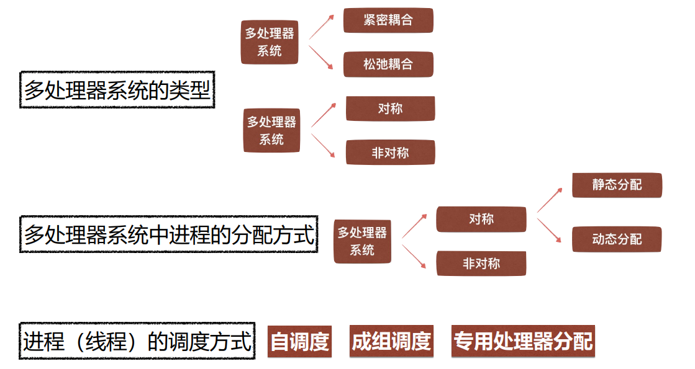

## 进程调度的功能与时机

### 功能
>   进程调度的功能由操作系统的**进程调度程序**完成

>   按照某种策略和算法**从就绪态进程中为当前空闲的CPU选择在其上运行的新进程**

### 时机
1. 进程正常结束 
1. 进程阻塞
1. 有更高优先级进程到来
1. 时间片用完 
1. 进程异常结束

## 进程调度算法

>   选择调度方式和算法的若干准则:

1.  **周转时间短**：作业从提交给系统开始，到作业完成，花费时间短
2.  **响应时间快**：从用户提交作业开始，到系统开始响应，花费时间短
3.  **截止时间的保证**：保证作业在“开始截止时间”前开始，在“完成截止时间”前完成
4.  **系统吞吐量高**：系统在单位时间内完成的作业量多
5.  **处理机利用率好**：CPU的利用率尽可能高


### 先来先服务调度算法FCFS
First-Come，First-Served

#### 含义
>   从就绪队列的队首**选择最先到达就绪队列**的进程，为该进程分配CPU

1.  **开始运行时间：上个进程结束**
2.  **等待时间：开始运行时间减进入时间**
3.  **周转时间：服务时间加等待时间**

#### 算法表格
|      进程名   | 进入系统时间    | 开始运行时间  | 服务时间 | 等待时间  | 周转时间 |
|      ------   | ------    | ------  | ------ | ------  | ------ |
|      p1   | 0    | 0  | 24 | 0  | 24 |
|      p2   | 1    | 24  | 3 | 23  | 26 |
|      p3   | 2    | 27  | 3 | 25  | 28 |

### 短进程优先调度算法SPF
Shortest-Process-First

#### 含义
>   从就绪队列中**选择估计运行时间最短**的进程，为该进程分配CPU

1.  **开始运行时间：上个进程结束**
2.  **等待时间：开始运行时间减进入时间**
3.  **周转时间：服务时间加等待时间**

#### 算法表格
|      进程名   | 进入系统时间    | 开始运行时间  | 服务时间 | 等待时间  | 周转时间 |
|      ------   | ------    | ------  | ------ | ------  | ------ |
|      p1   | 2    | 6  | 24 | 4  | 28 |
|      p2   | 1    | 3  | 3 | 2  | 5 |
|      p3   | 0    | 0  | 3 | 0  | 3 |

#### 优点
    与FCFS算法相比，短进程优先算法能有效降低进程的平均等待时间，提高系统吞吐量
#### 缺点
1.  对长进程不利；  
2.  不能保证紧迫进程的处理；
3.  进程长短由用户估计，不一定准确

### 优先权调度算法

#### 含义
>   该算法中，系统将CPU分配给就绪队列中**优先权最高的进程**

#### 类型

1.  非抢占式  
    运行期间，有更高优先权的进程到来，也**不能**剥夺CPU
2.  抢占式  
    运行期间，有更高优先权的进程到来，就**可以**抢占CPU

#### 优先权类型

1.  静态优先权  
    创建时确定，运行期间保持不变
2.  动态优先权  
    创建时确定，随着进程推进或等待时间增加而改变

#### 存在的问题
>   无穷阻塞（饥饿问题）

#### 解决的方案
>   增加等待时间很长的进程的优先权 老化技术


### 时间片轮转调度算法RR

#### 概念
>   **系统将所有就绪进程按先来先服务的原则，排成一个队列，每次调度时把CPU分给队首进程，并令其执行一个时间片。当时间片用完时，调度程序终止当前进程的执行，并将它送到就绪队列的队尾。**

#### 系统对响应时间的要求  
>   进程数量越多，时间片越小

#### 就绪队列中进程的数目  
>   响应时间要求越短，时间片越小

#### 系统的处理能力  
>   处理能力越好，时间片越小

#### 性能评价
1.  时间片很大=先来先服务算法
2.  时间片很小：增大cpu对进程切换和调度的开销
    

### 多级队列调度算法
>   将就绪队列**分成多个独立队列**，每个队列**有自己的调度算法**

### 多级反馈队列调度算法
>   建立**多个优先权不同的就绪队列**，每个队列有**大小不同的时间片**

## 实时系统中的调度

### 实现实时调度的基本条件

1.  提供必要的调度信息
2.  系统处理能力强
3.  采用抢占式调度机制
4.  具有快速切换机制

### 常用的实时调度算法

```
进程的紧迫程度 L=T-Tc-Ts
T：完成截止时间
Tc：当前时间
Ts：处理完该任务还需要的时间
```

#### 最早截止时间优先算法EDF
>   开始截止时间越早，进程优先级越高，越优先获得CPU

#### 进程的紧迫程度LLF

## 进程切换

### 含义
>   当前正在执行的进程成为被替换进程，让出其所使用的CPU，以运行被进程调度程序选中的新进程,这个过程称为**进程切换**

### 进程切换的步骤
1.  保存CPU上下文环境
2.  更新进程1控制块
3.  修改进程状态（执行——>就绪或阻塞）
4.  移动进程控制块到就绪队列或阻塞队列
5.  调度新程序，更新进程2控制块
6.  更新内存管理的数据结构
7.  回复进程的硬件上下文

## 多处理器调度


### 多处理器系统的类型

#### 耦合程度
1.  **紧密耦合**:共享主存储器和I/O设备
2.  **松弛耦合**:有各自的存储器和I/O设备

#### 结构功能
1.  **对称**:处理单元功能和结构相同（同构）
2.  **非对称**:有多种类型的处理单元一个主处理器，多个从处理器

### 多处理器系统的进程分配方式

#### 对称系统分配方式
1.  静态分配:就绪队列的进程只能在与就绪队列对应的处理器上运行
2.  动态分配:进程随机地被分配到当时处于空闲状态的某一处理器上执行

#### 非对称系统分配方式
>   主-从式操作系统

### 进程（线程）调度方式

#### 自调度
>   最常用最简单的方式  
>   任何一个空闲处理器都可以从就绪队列中选取一个进程或线程运行  
>   采用先来先服务调度算法

-   优点
    1.  易移植
    2.  有利于提高CPU的利用率

-   缺点
    1.  瓶颈问题
    2.  低效性
    3.  线程切换频繁

#### 成组调度
>   系统将一组相互合作的进程或线程同时分配到一组处理器上运行进程或线程与处理器一一对应

优点
1.  减少线程切换
2.  减少调度开销

#### 专用处理器分配
>   在程序执行期间，专门为该程序分配一组处理器，每个线程一个

-   优点
    1.  加快程序运行速度
    2.  避免进程切换
-   缺点
    1.  处理器资源严重浪费


## 死锁