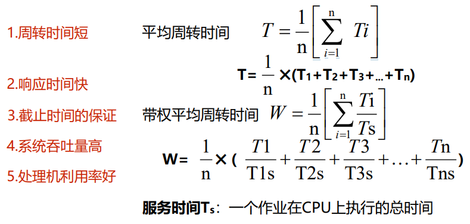

## 进程调度的功能与时机

### 功能
>   进程调度的功能由操作系统的**进程调度程序**完成

>   按照某种策略和算法**从就绪态进程中为当前空闲的CPU选择在其上运行的新进程**

### 时机
1. 进程正常结束 
1. 进程阻塞
1. 有更高优先级进程到来
1. 时间片用完 
1. 进程异常结束

## 进程调度算法

>   选择调度方式和算法的若干准则:

1.  **周转时间短**：作业从提交给系统开始，到作业完成，花费时间短
2.  **响应时间快**：从用户提交作业开始，到系统开始响应，花费时间短
3.  **截止时间的保证**：保证作业在“开始截止时间”前开始，在“完成截止时间”前完成
4.  **系统吞吐量高**：系统在单位时间内完成的作业量多
5.  **处理机利用率好**：CPU的利用率尽可能高

### 先来先服务调度算法FCFS
First-Come，First-Served

#### 含义
>   从就绪队列的队首**选择最先到达就绪队列**的进程，为该进程分配CPU

1.  **开始运行时间：上个进程结束**
2.  **等待时间：开始运行时间减进入时间**
3.  **周转时间：服务时间加等待时间**

#### 算法表格
|      进程名   | 进入系统时间    | 开始运行时间  | 服务时间 | 等待时间  | 周转时间 |
|      ------   | ------    | ------  | ------ | ------  | ------ |
|      p1   | 0    | 0  | 24 | 0  | 24 |
|      p2   | 1    | 24  | 3 | 23  | 26 |
|      p3   | 2    | 27  | 3 | 25  | 28 |

### 短进程优先调度算法SPF
Shortest-Process-First

#### 含义
>   从就绪队列中**选择估计运行时间最短**的进程，为该进程分配CPU

1.  **开始运行时间：上个进程结束**
2.  **等待时间：开始运行时间减进入时间**
3.  **周转时间：服务时间加等待时间**

#### 算法表格
|      进程名   | 进入系统时间    | 开始运行时间  | 服务时间 | 等待时间  | 周转时间 |
|      ------   | ------    | ------  | ------ | ------  | ------ |
|      p1   | 2    | 6  | 24 | 4  | 28 |
|      p2   | 1    | 3  | 3 | 2  | 5 |
|      p3   | 0    | 0  | 3 | 0  | 3 |

#### 优点
    与FCFS算法相比，短进程优先算法能有效降低进程的平均等待时间，提高系统吞吐量
#### 缺点
1.  对长进程不利；  
2.  不能保证紧迫进程的处理；
3.  进程长短由用户估计，不一定准确

### 优先权调度算法

#### 含义
>   该算法中，系统将CPU分配给就绪队列中**优先权最高的进程**

#### 类型

1.  非抢占式  
    运行期间，有更高优先权的进程到来，也**不能**剥夺CPU
2.  抢占式  
    运行期间，有更高优先权的进程到来，就**可以**抢占CPU

#### 优先权类型

1.  静态优先权  
    创建时确定，运行期间保持不变
2.  动态优先权  
    创建时确定，随着进程推进或等待时间增加而改变

#### 存在的问题
>   无穷阻塞（饥饿问题）

#### 解决的方案
>   增加等待时间很长的进程的优先权 老化技术

### 时间片轮转调度算法

### 多级队列调度算法

### 多级反馈队列调度算法

## 实时系统中的调度

## 进程切换

## 多处理器调度

## 死锁