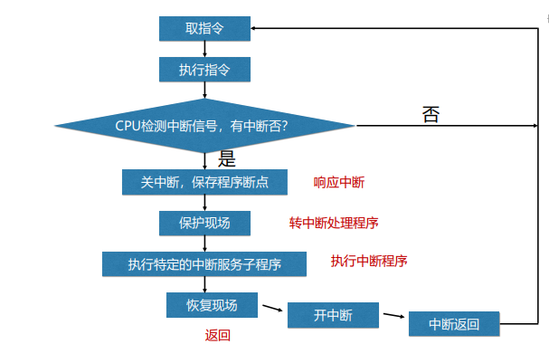

## 进程管理
### 进程的概念

#### 定义
>   允许并发执行的程序在某个数据集合上的运行过程

#### 特征
1.  **并发性**：多个进程实体能**在一段时间间隔内同时运行**  
    并发性是进程和现代操作系统的**重要特征**

2.  **动态性**：进程是实体的**执行过程**

3.  **独立性**：独立运行和资源调度的**基本单位**

4.  **异步性**：进程的执行时断时续，何时执行、何时暂停都**无法预知**
    
5.  **结构特征**：进程实体包括用户**正文段、用户数据段和进程控制块**

#### 进程和程序的比较
>   **进程**是**程序**的的一次执行  
>   一个**程序**可以对应多个**进程**
>   同一个**进程**能顺序地执行几个**程序**

-   进程:允许并发执行的程序在某个数据集合上的运行过程  
    特征：动态、暂时、包括正文段用户数据段进程控制块

-   程序:具有独立功能的一组指令的集合  
    特征：静态、永久、指令的集合

#### 进程控制块
>   定义：进程控制块是**进程实体的一部分**，是操作系统中**最重要的数据结构**

进程控制块中记录了操作系统所需要的、用于描述进程及控制进程运行所需的全部信息

1.  **进程标识符信息: 用于唯一标识一个进程**
2.  **处理机状态信息**
3.  **进程调度信息**
4.  **进程控制信息**

#### 进程的状态
>   **执行态、阻塞态、就绪态**

#### 进程的组织
>   **链接方式**  
把系统中具有相同状态的进程控制块PCB用其中的链接字连成一个队列

>   **索引方式**  
系统根据所有进程的状态，建立索引表，索引表的每一个表项指向一个PCB物理块

>   **进程队列**  
把具有相同状态的进程控制块用队列组织起来

### 进程的控制
>   进程四种状态：**创建、阻塞、唤醒、终止**

#### 创建
-   需要创建新进程的情况：  
    用户登录 作业调度 提供服务 应用请求

-   如何创建新进程？／创建新进程的步骤？  
    1.  申请空白PCB
    2.  为新进程分配资源
    3.  初始化进程控制块
    4.  将新进程插入到就绪队列

#### 阻塞
-   进程阻塞的情况：  
    请求系统服务 启动某种操作 新数据尚未到达 无新工作可做

-   完成进程阻塞的过程：
    1.  将进程的状态改为阻塞态
    2.  将进程插入相应的阻塞队列
    3.  转到进程调度程序，从就绪队列中选择进程为其分配CPU

#### 唤醒
进程唤醒的过程：
1.  将进程从阻塞队列中移出
2.  将进程状态由阻塞态改为就绪态
3.  将进程插入就绪队列

#### 终止
进程被终止的情况：  
进程正常执行完毕

完成进程终止的过程：  
1.  从进程PCB中读进程状态
2.  若进程正在执行，则终止进程的执行
3.  释放资源
4.  将终止进程的PCB移出

### 操作系统内核
>   概念： 支撑功能：中断处理、时钟管理、原语操作  
>   资源管理功能：进程管理、存储管理、设备管理

#### 中断
>   概念：  
>   中断是**改变处理器执行指令顺序**的一种事件  
>   出现中断时，计算机**停止现在程序的运行**，转向**对这些中断事件的处理**，处理结束后再**返回到现行程序的间断处**

>   为什么需要中断  
>   引入中断机制后，CPU可以与其他设备并行工作，能有效**提高CPU的利用率**，改善系统性能，**支持系统的异步**操作。

-   中断的分类  
    1.  同步中断（也称内部中断或异常）
    2.  异步中断（也称外部中断）
        1.  外部可屏蔽中断
        2.  外部不可屏蔽中断

-   🤔️引起中断的原因
    1.  人为设置中断
    2.  程序性事故
    3.  硬件故障
    4.  I/O设备
    5.  外部事件

-   中断的处理的过程

#### 时钟管理

#### 系统调用
