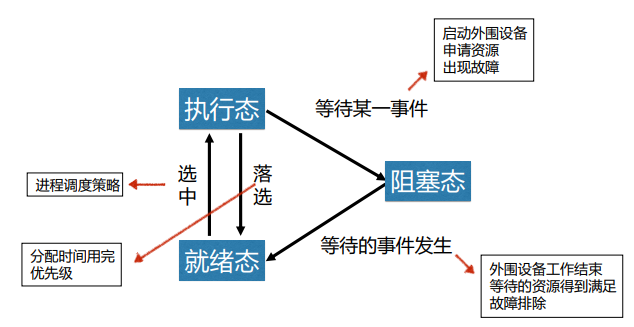

## 进程的概念

### 定义
>   允许并发执行的程序在某个数据集合上的运行过程

### 特征
1.  **并发性**：多个进程实体能**在一段时间间隔内同时运行**  
    并发性是进程和现代操作系统的**重要特征**

2.  **动态性**：进程是实体的**执行过程**

3.  **独立性**：独立运行和资源调度的**基本单位**

4.  **异步性**：进程的执行时断时续，何时执行、何时暂停都**无法预知**
    
5.  **结构特征**：进程实体包括用户**正文段、用户数据段和进程控制块**

### 进程和程序的比较
>   **进程**是**程序**的的一次执行  
>   一个**程序**可以对应多个**进程**
>   同一个**进程**能顺序地执行几个**程序**

-   进程:允许并发执行的程序在某个数据集合上的运行过程  
    特征：动态、暂时、包括正文段用户数据段进程控制块

-   程序:具有独立功能的一组指令的集合  
    特征：静态、永久、指令的集合

### 进程控制块
>   定义：进程控制块是**进程实体的一部分**，是操作系统中**最重要的数据结构**

进程控制块中记录了操作系统所需要的、用于描述进程及控制进程运行所需的全部信息

1.  **进程标识符信息: 用于唯一标识一个进程**
2.  **处理机状态信息**
3.  **进程调度信息**
4.  **进程控制信息**

### 进程的状态
>   **执行态、阻塞态、就绪态**



### 进程的组织
>   **链接方式**  
把系统中具有相同状态的进程控制块PCB用其中的链接字连成一个队列

>   **索引方式**  
系统根据所有进程的状态，建立索引表，索引表的每一个表项指向一个PCB物理块

>   **进程队列**  
把具有相同状态的进程控制块用队列组织起来

## 进程的控制
>   进程控制的四种状态：**创建、阻塞、唤醒、终止**

### 创建
-   需要创建新进程的情况：  
    用户登录 作业调度 提供服务 应用请求

-   如何创建新进程？／创建新进程的步骤？  
    1.  申请空白PCB
    2.  为新进程分配资源
    3.  初始化进程控制块
    4.  将新进程插入到就绪队列

### 阻塞
-   进程阻塞的情况：  
    请求系统服务 启动某种操作 新数据尚未到达 无新工作可做

-   完成进程阻塞的过程：
    1.  将进程的状态改为阻塞态
    2.  将进程插入相应的阻塞队列
    3.  转到进程调度程序，从就绪队列中选择进程为其分配CPU

### 唤醒
进程唤醒的过程：
1.  将进程从阻塞队列中移出
2.  将进程状态由阻塞态改为就绪态
3.  将进程插入就绪队列

### 终止
进程被终止的情况：  
进程正常执行完毕

完成进程终止的过程：  
1.  从进程PCB中读进程状态
2.  若进程正在执行，则终止进程的执行
3.  释放资源
4.  将终止进程的PCB移出

## 操作系统内核
>   概念： 支撑功能：中断处理、时钟管理、原语操作  
>   资源管理功能：进程管理、存储管理、设备管理

### 中断
>   概念：  
>   中断是**改变处理器执行指令顺序**的一种事件  
>   出现中断时，计算机**停止现在程序的运行**，转向**对这些中断事件的处理**，处理结束后再**返回到现行程序的间断处**

>   为什么需要中断  
>   引入中断机制后，CPU可以与其他设备并行工作，能有效**提高CPU的利用率**，改善系统性能，**支持系统的异步**操作。

-   中断的分类  
    1.  同步中断（也称内部中断或异常）
    2.  异步中断（也称外部中断）
        1.  外部可屏蔽中断
        2.  外部不可屏蔽中断

-   🤔️引起中断的原因
    1.  人为设置中断
    2.  程序性事故
    3.  硬件故障
    4.  I/O设备
    5.  外部事件

-   中断的处理的过程


### 时钟管理
>   时钟是计算机系统的脉搏，计算机的很多活动都是由**定时测量**来驱动的
#### 计算机系统中的时钟

-   实时时钟(RTC)  
    计算机开机加电后，操作系统通过BIOS获取当前RTC的值作为系统的初始时间

-   OS时钟  
    产生于PC主板上的定时/计数芯片，在开机时有效，由操作系统控制。

#### 操作系统的时钟机制
-   时钟硬件：保存当前的日期和时间

-   时钟驱动程序：维持定时器


### 系统调用

#### 系统调用的概念
>   系统调用是一群预先定义好的模块  
>   提供一条管道让应用程序能由此到核心程序的服务  
>   系统调用是系统程序与用户程序之间的接口

#### 系统调用和一般函数调用的区别
>   区别1:系统调用运行在系统态，一般函数运行在用户态  
>   区别2:执行过程不同（系统调用执行时，当前进程被中断）  
>   区别3:系统调用进行中断处理，多了系统开销

-   系统态执行  
    CPU执行系统核心代码时，称该进程处于系统态执行
-   用户态执行  
    CPU执行用户空间的代码时，称该进程处于用户态执行

#### 系统调用的类型
1.  进程控制类
2.  文件操纵类
3.  设备管理类
4.  通信类
5.  信息维护类

## 进程同步
>   同步机制：保证在多任务共享系统资源的情况下，程序执行能得到正确的结果

### 基本概念
多道程序环境下进程之间的关系
1.  资源共享关系：保证各进程以**互斥**的方式访问**临界资源**
1.  相互合作关系：保证相互合作的各进程**协调**执行

>   必须**以互斥方式访问**的共享资源称为**临界资源**

>   进程中**访问临界资源**的那段**代码**称为**临界区**

### 应遵循的准则
-   **空闲让进**:  
    没有进程处于临界区，应允许一个请求进入临界区的进程进入
-   **忙则等待**:  
    临界区已有进程，其他试图进入临界区的进程必须等待
-   **有限等待**:  
    对于要访问临界资源的进程，应保证有限时间内进入临界区
-   **让权等待**:  
    申请不到访问权，应释放处理机，以免浪费CPU资源

### 信号量机制
>   保证在多任务共享系统资源的情况下，程序执行能得到正确的结果

用**信号量**的取值来表示资源的使用状况，以此为基础实现进程同步

#### 整型信号量机制


整型信号量是表示共享资源状态且只能只能由特殊的原子操作改变的整型量  
原理：定义一个整型变量，用该变量的值来标记资源的使用情况，初始值为1  
整型信号量 >=0 有资源可用  
整型信号量 <=0 资源忙，需等待

##### 用整型信号量实现进程互斥
为互斥访问的临界资源CS定义一个互斥信号量mutex，将初始值置为1  
将临界资源CS放入wait(mutex)和signal(mutex)之间

#### 记录型信号量机制
>   s.value>=0时，s.value的值表示**资源数量**  
>   s.value<0时，s.value的**绝对值**表示等待队列中**阻塞进程的数量**  
```
Type semaphore = record
    Value: integer; //资源数量
    L: list of process; //阻塞队列
end

Var s semaphore;

wait(s) //请求资源
{
 s.value=s.value-1;
 if s.value<0 then block(s.L)
}

signal(s) //释放资源
{
 s.value=s.value+1;
 if s.value<=0 then
wakeup(s.L)
}
```

##### 原理
>   定义一个记录型变量，用该变量的值来标记资源的使用情况

## 进程通信

### 共享存储器系统(高级通信机制)
>   相互通信的进程共享某些**数据结构**或**共享存储区**

### 消息传递系统(高级通信机制)
>   进程间通过操作系统提供的一组通信程序传递消息

### 管道通信(高级通信机制)
>   进程间通过管道(链接读写进程的特殊文件)进行信息通信

### 消息缓冲队列
>   利用消息缓冲区、发送原语和接收原语实现信息通信

## 线程

### 概念
>   允许并发执行的程序在某个数据集合上的运行过程

>   线程是**进程中**可以**独立执行的子任务**

>   线程是进程中的一个实体，是被系统**独立调度和分派**的**基本单位**

>   线程只拥有在运行中必需的资源，包括**程序计数器、一组寄存器和栈**，但它可与同一进程的其他线程**共享进程所拥有的全部资源**。

### 分类
-   内核级线程  
    依赖于内核

-   用户级线程  
    不依赖内核

### 线程的3种基本状态


### 线程控制块
>   每一个线程都由一个数据结构表示，包括它的基本状态等，这个数据结构就是**线程控制块TCB**

TCB记录了操作系统需要的、用于描述线程情况及控制线程运行所需的全部信息。

### 线程与进程的关系
1. 资源和调度。**线程**是程序**执行的基本单位**，**进程**是**拥有资源的基本单位**。
2. 地址空间资源。不同进程的地址空间是相互独立的，而**同一进程中的各线程共享同一地址空间**。
3. 通信关系。进程之间的通信必须使用操作系统提供的进程间通信机制，而**同一进程中的各线程间可以通过直接通信**。
4. 并发性。多进程之间可以并发执行，**多线程之间也可以并发执行**。
5. 系统开销。**线程切换的开销**比进程切换的开销小

### 线程的控制

#### 创建
1）用户线程的创建  
2）内核线程的创建

#### 阻塞
1）请求系统服务  
2）启动某种操作  
3）新数据尚未到达

#### 唤醒

#### 终止
1）正常结束  
2）异常结束  
3）外界干扰

#### 调度 

#### 切换
1）用户线程的调度与切换  
2）内核线程的调度与切换