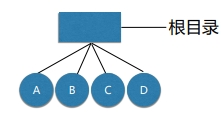
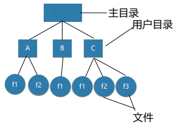
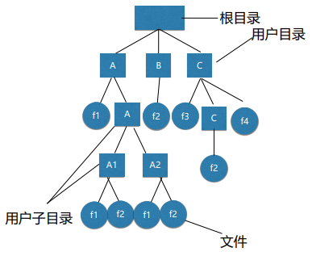

## 文件
>   文件系统的用户接口包括文件**的命名、类型、属性和对文件的操作**

### 文件命名
>   所有操作系统都允许用**1～8个字母组成的字符串**

多数操作系统都支持文件名用圆点隔开分为两部分，圆点后面的部分称为文件扩展名

### 文件结构
1.  无结构字节序列（流式文件）  
    优点: **提供灵活性**

2.  固定长度记录序列   
    中心思想: **读操作返回一个记录,写操作重写或追加一个记录**

3.  树形结构  
    记录长度不定,在记录的固定位置包含一个**关键字域**,记录树**按关键字域排序**

### 文件类型
1.  正规文件
    -   ASCII文件: 可显示和打印，通常的文本编辑器可编辑
    -   二进制文件: 不能直接显示和打印，需要专门编辑器

2.  目录文件  
    管理文件系统的**系统文件**

3.  字符设备文件  
    和**输入输出**有关

4.  块设备文件  
    用于**磁盘类**设备

### 文件存取

1.  顺序存取  
    早期，从文件开始处读取信息，不能跳过
2.  随机存取  
    又称直接存取，可以以任意顺序读取文件信息

### 文件属性
除了文件名和文件数据外，其他与文件相关的信息，如创建日期、文件大小、修改时间

### 文件操作
1.  CREATE 创建
1.  DELETE 删除
1.  OPEN 打开
1.  CLOSE 关闭
1.  READ 读
1.  WRITE 写
1.  APPEND 文件末尾添加数据
1.  SEEK 找到读取位置
1.  GETATTRIBUTES 获取文件属性
1.  SETATTRIBUTES 设置文件属性
1.  RENAME 重命名

## 目录
>   目录是文件系统中实现**按名访问**的重要数据结构

### 目录文件的结构
>   目录文件有两种常见的结构：属性放在**目录项**中和放在**i结点**中

### 目录结构
1.  单层目录（根目录）  
    问题：**文件命名、搜索效率低**

2.  两级目录  
    -   优点：**解决重名问题，查找快**  
    -   缺点：**增加系统开销**

3.  树形目录  
    -   优点： 
        **便于文件分类、 层次结构清晰、 便于管理和保护、 解决了重名问题、 查找速度加快**
    -   缺点：  
        **结构相对复杂**

### 路径名
采用树形目录时，需要有某种方法指明文件

1.  绝对路径名  
    从根目录到文件
2.  相对路径名  
    从当前工作目录到文件

### 目录操作
1.  CREATE 创建
1.  DELETE 删除
1.  OPENDIR 打开目录
1.  CLOSEDIR 关闭目录
1.  READDIR 读目录
1.  RENAME 重命名

## 文件系统的实现

