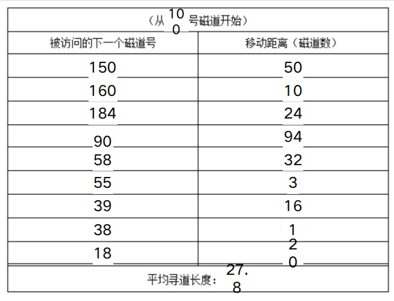

## I/O系统的组成

>   I/O系统不仅包括各种**I/O设备**，还包括与设备相连的**设备控制器**，有些系统还配备了专门用于输入/输出控制的专用计算机，即**通道**。此外，I/O系统要通过总线与CPU、内存相连

### I/O系统的结构
>   I/O系统的结构分为两大类：**微机I/O系统 主机I/O系统**

1.  微机I/O系统  
    >   CPU与内存之间可以直接进行信息交换  
    >   但是**不能与设备直接进行信息交换**  
    >   必须经过**设备控制器**

    

2.  主机I/O系统  
    >   主机I/O系统采用四级结构  
    >   包括**主机、通道、控制器和设备**，一个通道可以控制多个设备控制器  
    >   一个设备控制器也可以控制多个设备

    

### I/O设备的分类

1.  按**传输速率**分类
    -   低速设备  例：鼠标  键盘
    -   中速设备  例：打印机
    -   高速设备  例：磁带机、磁盘机、光盘机

2.  按**信息交换单位**分类
    -   块设备  例：磁盘
    -   字符设备  例：打印机

3.  按设备的**共享属性**分类
    -   独占设备  例：打印机
    -   共享设备  例：磁盘
    -   虚拟设备

### 设备控制器

#### 什么是设备控制器

1.   设备控制器是**CPU与I/O设备之间的接口**，接收I/O的命令并**控制设备完成I/O工作**  
2.   设备控制器是一个**可编址设备**，连接多个设备时可有多个设备地址

#### 设备控制器的功能
1.  接收和识别命令
2.  数据交换：
3.  设备状态的了解和报告
4.  地址识别
5.  数据缓冲
6.  差错控制

#### 设备控制器的组成
1.  设备控制器**与处理机的接口**：  
    数据线、控制线、地址线

2.  设备控制器**与设备的接口**：  
    接口中3类信号为数据、状态、控制信号

3.  **I/O逻辑**：  
    主要由**指令译码器和地址译码器**两部分功能部件构成

### I/O通道

>   一种特殊的处理机，它具有执行I/O指令的能力，并通过执行通道程序来控制I/O操作  
>   大型主机系统中**专门用于I/O的专用计算机**  
>   引入通道能够使CPU从控制I/O操作的任务中解脱，使**CPU与I/O并行工作**，提高CPU利用率和系统吞吐量

## I/O控制方式

### 轮询控制方式

>   主机试图发送I/O控制命令之前  
>   先通过**反复检测设备控制器状态寄存器的忙/闲标志位**  
>   若设备“忙”，主机继续检测该标志位  
>   直到该位为“空闲”，主机发送I/O指令

-   缺点：  
    使CPU经常处于循环测试状态，造成CPU的极大浪费，影响整个进程的吞吐量

### 中断控制方式


-   优点：  
    使**CPU和I/O设备**在某些时间段上**并行工作**，提高**CPU的利用率和系统的吞吐量**

### DMA控制方式

#### DMA控制器结构

DMA控制器的逻辑组成包括3部分
1.  DMA**与主机的接口**
2.  DMA**与设备的接口**
3.  **I/O控制逻辑**

#### DMA控制器中的寄存器
1.  **命令/状态寄存器CR**  
    用于接收从CPU发来的**I/O命令或有关控制信息、设备状态**

2.  **内存地址寄存器MAR**  
    **存放内存地址**
    在输出数据时，**存放输出数据在内存的起始地址**，指示DMA应该从内存的什么地方读取输出数据  
    在输入数据时，**存放输入数据将要被放入内存的起始地址**，指示DMA应该把输入数据放在内存的什么地方

3.  **数据寄存器DR**  
    用于暂存DMA传输中**要输入或输出的数据**

4.  **数据计数器DC**  
    指示DMA，本次向CPU发中断信号前要**读或写数据的次数**

#### DMA工作方式流程
当CPU要从磁盘读入一个数据块时，就向磁盘控制器发送一条读命令。  

该命令被送到DMA的命令寄存器CR中，同时CPU将本次读入数据将要放在内存中的起始地址送DMA的MAR寄存器，将本次要读的字节数送入DC寄存器。  

然后启动DMA控制器进行数据传输，在DMA控制输入过程中，CPU可以执行其他的进程，当本次读入的数据全部传输完毕后，DMA向CPU发送中断请求。

## 缓冲管理

>   缓冲区是用来**保存两个设备之间或设备与应用程序之间传输数据的内存区域**

>   由于CPU的速度远远高于I/O设备，为了**尽可能使CPU与设备并行工作**，提高系统的性能，通常需要操作系统在设备管理软件中提供缓冲区管理功能。

### 缓冲的引入

-   引入缓冲的主要原因  
>   （1） 处理数据流的**生产者与消费者之间的速度差异**  
>   （2） 协调传输**数据大小不一致**的设备

-   引入缓冲的主要作用
>   引入缓冲区除了可以**缓和CPU与I/O设备之间速度不匹配**的矛盾，还能**提高CPU和I/O设备之间的并行性**。

### 单缓冲
>   最简单的缓冲类型，在主存储器的系统区中**只设立一个缓冲区**


### 双缓冲（缓冲交换）
当一个进程往这一个缓冲区中传送数据（或从这个缓冲区读取数据）时，操作系统正在清空（或填充）另一个缓冲区，这种技术称为双缓冲(DoubleBuffering)，或缓冲交换(Buffering Swapping)


### 循环缓冲
>   在数据到达和数据离去的速度差别很大的情况下，需要增加缓冲区的数量

-   多个缓冲区
    1.  空缓冲区R
    2.  已装满数据的缓冲区G
    3.  现行工作缓冲区C

-   多个指针
    1.  Nextg 用于指示**消费者进程下一个可用的装有数据的缓冲区**
    2.  Nexti 用于指示**生产者进程下一个可用的空缓冲区**
    3.  Current 用于指示进程**正在使用的工作缓冲区**

-   Getbuf过程
    1.  消费者进程要**使用缓冲区中数据**时调用
    2.  生产者进程要**使用空缓冲区装数据**时调用

-   Releasebuf过程
    进程使用完缓冲区后，调用Releasebuf过程**释放缓冲区**


## 设备分配

### 设备分配中的数据结构
支持设备分配的数据结构需要记录设备的状态（忙或空闲）、设备类型等基本信息 

####  设备控制表DCT(Device Control Table)
>   系统为每个设备建立一张设备控制表，多台设备控制表构成设备控制表集合。  
>   每张设备控制表包含**设备类型、设备标识符、设备状态（忙/闲）等信息**

####  控制器控制表COCT(Controller Control Table)
>   系统为每个控制器设置一张**用于记录该控制器信息**的控制器控制表，通常包含控**制器标识符、控制器状态等信息**。

####  通道控制表CHCT(Channel Control Table)
>   系统为每个通道设备设一张通道控制表，通常包含**通道标识符、通道状态等信息**。

####  系统设备表SDT(System Device Table)
>   记录了系统中全部设备的情况，每个设备占一个表目，其中包括**设备类型、设备标识符、设备控制表及设备驱动程序的入口地址**

### 设备分配
设备分配应考虑以下3个因素：  
-  设备的固有属性  
    1.  **独占设备**  
    独享分配策略
    2.  **共享设备**  
        可同时分配给多个进程使
    3.  **可虚拟设备**  
        用可同时分配给多个进程使用

-  设备分配算法  
    1.  **先来先服务**  
        根据进程对某设备提出请求的先后顺序分配
    2.  **基于优先权的分配算法**  
        对高优先权进程所提出的I/O请求也赋予高优先权

-  设备分配方式
    1.  **安全分配方式**  
    发出I/O请求后进入阻塞状态摒弃“请求和保持”条件，是设备分配是安全的
    2.  **不安全分配方式**  
    仅当请求的设备被占用，进程才进入阻塞状态可能具备“请求和保持”条件，从而可能造成死锁

### 设备独立性(设备无关性)

#### 设备独立性的基本含义  
>   应用程序独立于具体使用的物理设备  
>   应用程序中，使用**逻辑设备名称**来请求使用某类设备  
>   系统在实际执行时，必须使用**物理设备名称**

#### 实现设备独立性带来的好处
1.  应用程序与物理设备无关
2.  易于处理输入/输出设备的故障
3.  提高了系统的可靠性，增加了设备分配的灵活性

#### 设备独立软件的功能
1.  执行所有设备的公有操作  
    包括独占设备的分配与回收、将逻辑设备名转换为物理设备名、对设备进行保护等
2.  向用户层软件提供统一的接口  
    向应用软件和最终用户提供简单、统一的访问接口

#### 独占设备的分配程序
1.  分配设备
2.  分配控制器
3.  分配通道

### SPOOLing技术

#### SPOOLing的含义
>   在多道程序环境下，利用**一道程序**来模拟**脱机输入**时的**外围控制机**的功能，把低速I/O设备上的数据传送到高速输出磁盘上，再利用**另一道程序**来模拟**脱机输出**时**外围控制机**的功能，把数据从磁盘传送到低速输出设备上。

>   这种在**联机情况下实现的同时外围操作**称为SPOOLing(Simultaneous Peripheral Operations On-Line)

#### SPOOLing的组成
1.  输入井和输出井
2.  输入缓冲区和输出缓冲区
3.  输入进程SPi和输出进程SPo
4.  请求I/O队列

#### 利用SPOOLing技术实现共享打印机
1.  由输出进程在输出井中申请空闲盘块区，并将要打印的数据送入其中。
2.  输出进程再为用户申请并填写一张用户请求打印表，将该表干到请求打印队列上。

#### SPOOLing的特点
1.  提高了**I/O速度** (使用了磁盘作为低速设备的大容量缓存)
2.  将**独占**设备改造为**共享**设备
3.  实现了**虚拟设备**功能

## I/O软件原理

>   输入输出软件的总体目标是**将软件组织成一种层次结构**  
>   **低层软件**用来屏蔽硬件的具体细节  
>   **高层软件**则主要是为用户提供一个简洁、规范的界面

### 设备管理的4个层次
1.  用户层软件  
    向系统发出I/O请求，显示I/O操作的结果，提供用户与设备的接口

2.  与设备无关的软件层  
    完成设备命名、设备分配、设备独立性和缓冲管理等功能

3.  设备驱动程序
    与硬件关系最密切，包括设备服务程序和中断处理程序

4.  中断处理程序（底层）

### 设备管理软件的功能
```
（1） 实现I/O设备的独立性
（2） 错误处理
（3） 异步传输
（4） 缓冲管理
（5） 设备的分配和释放
（6） 实现I/O控制方式
```

### 中断处理程序

#### 中断处理程序的作用
>   I/O中断处理程序的作用是**将发出I/O请求而被阻塞的进程唤醒**。

### 设备驱动程序
>   设备驱动程序是**I/O进程与设备控制器之间的通信程序**，其主要任务是接受上层软件发来的抽象的I/O请求，如read和write命令，把它们转换为具体要求后，发送给设备控制器启动设备去执行

### 与硬件无关的I/O软件
设备无关的I/O软件的功能如下：
```
（1） 设备命名
（2） 设备保护
（3） 提供独立于设备的块大小
（4） 为块设备和字符设备提供必要的缓冲技术（5） 块设备的存储分配
（6） 分配和释放独立设备
（7） 错误处理
```

## 磁盘管理
>   磁盘存储器不仅**容量大，存取速度快**，而且可以实现**随机存取**，是存放大量程序和数据的理想设备。

>   磁盘管理的重要目标是提高磁盘**空间利用率**和磁盘**访问速度**。

### 磁盘结构
>   一个物理记录存储在一个扇区上，磁盘存储的物理记录数目是由**扇区数、磁道数及磁盘面**数决定的


#### 磁盘类型
1.  固定头磁盘  
    在每条磁道上都有读/写磁头
2.  活动头磁盘 (移动头)  
    每一个盘面仅配有一个磁头

#### 磁盘访问时间
1.  **寻道时间**  
    磁头移动到指定磁道所经历的时间

2.  **旋转延迟时间**  
    指定扇区移动到磁头下面所经历的时间

3.  **传输时间**  
    把数据从磁盘读出或向磁盘写入数据时所经历的时间


### 磁盘调度
>   磁盘调度的一个重要目标是**使磁盘的平均寻道时间最少**

#### 先来先服务 (First Come First Served, FCFS)
>   **最简单**的磁盘调度算法  
>   根据进程**请求访问磁盘的先后顺序**进行调度

>   **按顺序**

-   优点  
    公平、简单，且每个进程的请求都能依次得到处理，不会出现某进程的请求长期得不到满足的情况
-   缺点  
    平均寻道时间较长


#### 最短寻道时间优先 (Shortest Seek Time First, SSTF)
>   该算法选择的进程：其**要求访问的磁道**与**当前磁头所在的磁道**距离**最近**，以使每次的寻道时间最短

>   **离谁近**

-   优点  
    每次的寻道时间最短，较之FCFS有更好的寻道性能
-   缺点  
    可能导致某个进程发生**饥饿**现象


#### 扫描算法 (SCAN)(电梯调度算法)
不仅考虑到要访问的磁道与当前磁道的距离，更优先考虑磁头当前的移动方向。
>   **顺着方向走，挨个访问，然后调头**
-   优点  
    有较好的寻道性能，防止“饥饿”现象
-   缺点  
    有时候进程请求被大大推迟


#### 循环扫描算法 (CSCAN)
在扫描算法的基础上，规定磁头是单向移动的。将最小磁道号紧接着最大磁道号构成循环，进行循环扫描
>   **顺着方向走，挨个访问，然后从1开始再顺着方向走**

#### NStepSCAN和FSCAN调度算法

-   NStepSCAN  
    >   将磁盘请求队列分成**若千个长度为N的子队列**  
    >   磁盘调度将按**FCFS算法**依次处理这些子队列  
    >   每处理一个队列时又是按照**SCAN算法**对一个队列处理后，再处理其他队列

-   FSCAN  
    >   NStepSCAN算法的简化，将磁盘请求队列分成**两个子队列**  
    >   一个是由当前所有请求磁盘访问的进程形成的队列  
    >   由磁盘调度按**SCAN算法**进行处理  
    >   将新出现的所有请求磁盘访问的进程放入另一个等待处理的请求队列

### 提高磁盘I/O速度的方法

1.  提前读  
    减少读数据的时间
2.  延迟写  
    减少写磁盘的次数
3.  优化物理块的分布  
    减少磁臂移动距离
4.  虚拟盘  
    存放临时文件
5.  磁盘高速缓存  
    逻辑上属于磁盘 物理上在内存中


## 先来先服务FCFS+最短寻道时间优先SSTF例题

```
假设磁盘有1000个磁道，若磁盘请求是一些随机请求，它们按照到达的次序分别处于
811、 348、153、968、407、580、233、679、801、121磁道。
当前磁头在656号磁道上，并且读写磁头正在向磁道号增加的方向移动。要求：
1.  给出用FCFS算法进行磁盘调度时满足请求的次序，并计算出它们的平均寻道长度。
2.  给出用SSTF算法进行磁盘调度时满足请求的次序，并计算出它们的平均寻道长度。
```

1.  给出用FCFS算法进行磁盘调度时满足请求的次序，并计算出它们的平均寻道长度。

```
当前: 
    656 —> 
    811 —> 
    348 —>
    153 —>
    968 —>
    407 —>
    580 —>
    233 —>
    679 —>
    01  —>
    121
    
平均寻道长度：3957/10=395.7
```


2.  给出用SSTF算法进行磁盘调度时满足请求的次序，并计算出它们的平均寻道长度。

```
当前:
656 —>
679 —>
580 —>
407 —>
348 —>
233 —>
153 —>
121 —>
801 —>
811 —>
968

平均寻道长度：1428/10=142.8
```

## 扫描SCAN+循环扫描CSCAN例题
```
假设磁盘有1000个磁道，若磁盘请求是一些随机请求，
它们按照到达的次序分别处于
150、160、184、90、58、55、39、38、18磁道。
当前磁头100号磁道上，并且读写磁头正在向磁道号增加的方向移动。要求：
1.给出用SCAN算法进行磁盘调度时满足请求的次序，并计算出它们的平均寻道长度。
2.给出用CSCAN算法进行磁盘调度时满足请求的次序，并计算出它们的平均寻道长度。
```
1.  给出用SCAN算法进行磁盘调度时满足请求的次序，并计算出它们的平均寻道长度。

```
当前: 
100 —>
150 —>
160 —>
184 —>
90 —>
58 —>
55 —>
39 —>
38 —>
18
平均寻道长度：250/9=27.8
```

2.  给出用CSCAN算法进行磁盘调度时满足请求的次序，并计算出它们的平均寻道长度。

```
当前: 
100 —>
150 —>
160 —>
184 —>
18 —>
38 —>
39 —>
55 —>
58 —>
90

平均寻道长度：322/9=35.8
```