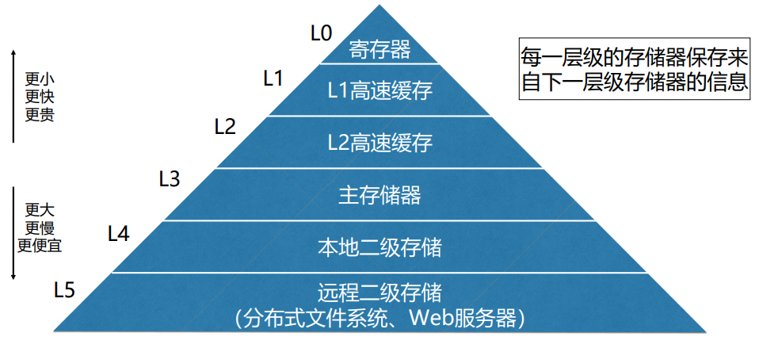
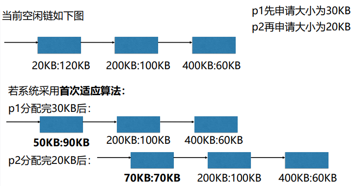
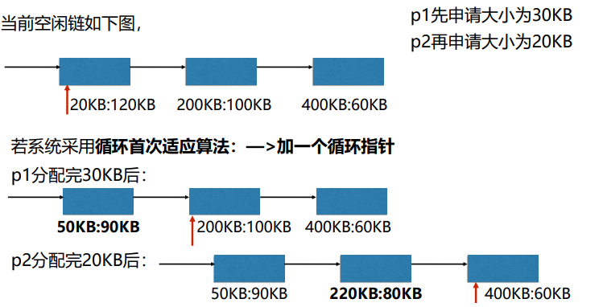
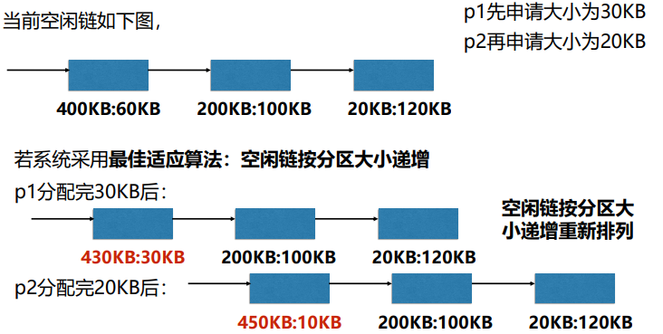
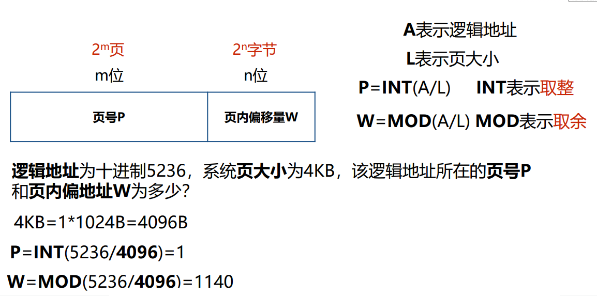
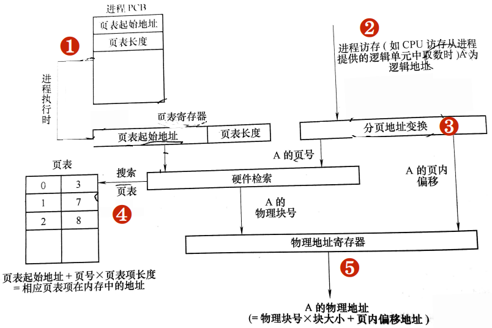

## 存储器的层次结构

### 局部性原理
>   在一段较短时间内，程序的执行仅限于某个部分，相应地，它所访问的存储空间也局限于某个区域。

-   时间局部性  
    某条指令一旦执行，不久后该指令可能再次执行

-   空间局部性  
    一旦程序访问了某个单元，不久后附近的存储单元也将被访问

## 程序的链接和装入

### 程序的链接
>   将编译后的目标模块装配成一个可执行程序

-   静态链接  
    程序运行前，用**链接程序**将目标模块链接成一个完整的装入模块。

-   动态链接  
    可将某些目标模块的链接推迟到这些模块中的函数被调用执行时才进行。

### 程序的装入

-   绝对装入方式  
    >   编译时产生物理地址的目标代码

-   可重定位装入方式（静态重定位）  
    >   程序装入时对目标程序中的指令和**数据地址的修改**过程叫重定位  
    >   编译时地址是**逻辑地址，装入时**通过重定位转换为**物理地址**

-   动态运行时装入（动态重定位）  
    >   程序执行时通过**重定位**转换为物理地址

## 连续分配存储管理方式

### 单一连续分配
>   任何时刻主存储器最多只有一个作业

### 固定分区分配
>   每个分区大小固定不变，每个分区可以且仅可以装入一个作业

### 动态分区分配
>   每个分区大小固定不变，每个分区可以且仅可以装入一个作业

#### 空闲分区表
>  包括：**分区编号、分区大小、起始地址**

#### 空闲分区链
>   动态地为每一个分区建立一个结点

#### 动态分区分配算法

-   首次适应算法  
    >   空闲分区链以**地址递增**的顺序链接  
    >   从**链首**开始查找  
    >   直至找到**第一个满足要求**的空闲分区  
    >   从该分区中划出一块内存给进程剩下的仍留在空闲链中

    

-   循环首次适应算法  
    >   从**上次找到的**空闲分区的**下一个**空闲分区开始查找

    

-   最佳适应算法  
    >   空闲分区链以**分区大小递增**的顺序链接  
    >   从**链首**开始查找  
    >   直至找到第一个与进程请求的空间大小**最接近**的空闲分区

    

#### 动态分区分配的流程
1.  检索空闲分区链
2.  分配空闲分区（小就直接分，太大就割一块分）
3.  讲分配给进程的分区起始地址返回给内存分配程序的调用者
4.  修改空闲分区链表

#### 动态分区回收的流程
1.  释放一块连续的内存区域
2.  如果被释放的区域与其他空闲区相邻，则合并空闲区
3.  修改空闲分区链

## 基本分页存储管理方式

### 分页存储管理的基本原理

#### 分页存储管理的基本概念
-   页  
    >   将一个进程的**逻辑地址空间**分成若干个大小相等的**片**
-   页框  
    >   将**物理内存空间**分成与页大小相同的若干个**存储块**
-   分页存储  
    >   将进程中的若干**页**分别装入多个**可以不相邻的页框**中
-   页内碎片
    >   进程**最后一页**一般装不满一个页框，形成**页内碎片**
-   页表
    >   实现**从页号到页框号**的映射

#### 分页地址结构

#### 分页地址变换

1.  进程执行，PCB中页表起始地址和页表长度送CPU的页表寄存器
2.  CPU访问某个逻辑单元A
3.  由分页地址变换硬件自动将A分为页号和页内偏移两部分
4.  由硬件检索页表，得到A所在的页对应的页框号
5.  页框号和页内偏移地址送物理地址寄存器，计算物理地址。
 物理地址=页框大小✖️页框号+页内偏移量

### 快表

### 两级和多级页表

## 基于分页的虚拟存储系统

## 分段存储管理

## Linux的伙伴系统