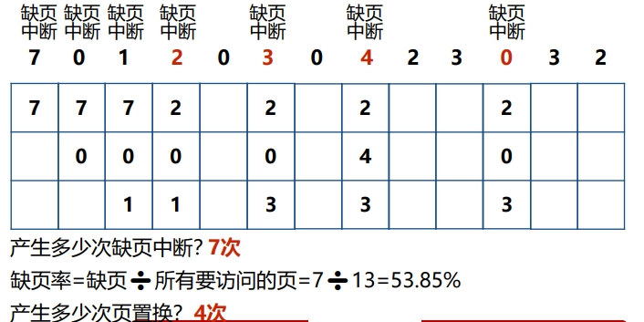
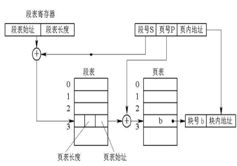

## 存储器的层次结构


### 局部性原理
>   在一段较短时间内，程序的执行仅限于某个部分，相应地，它所访问的存储空间也局限于某个区域。

-   时间局部性  
    某条指令一旦执行，不久后该指令可能再次执行

-   空间局部性  
    一旦程序访问了某个单元，不久后附近的存储单元也将被访问

## 程序的链接和装入

### 程序的链接
>   将编译后的目标模块装配成一个可执行程序

-   静态链接  
    程序运行前，用**链接程序**将目标模块链接成一个完整的装入模块。

-   动态链接  
    可将某些目标模块的链接推迟到这些模块中的函数被调用执行时才进行。

### 程序的装入

-   绝对装入方式  
    >   编译时产生物理地址的目标代码

-   可重定位装入方式（静态重定位）  
    >   程序装入时对目标程序中的指令和**数据地址的修改**过程叫重定位  
    >   编译时地址是**逻辑地址，装入时**通过重定位转换为**物理地址**

-   动态运行时装入（动态重定位）  
    >   程序执行时通过**重定位**转换为物理地址


## 连续分配存储管理方式

### 单一连续分配
>   任何时刻主存储器最多只有一个作业

### 固定分区分配
>   每个分区大小固定不变，每个分区可以且仅可以装入一个作业

### 动态分区分配
>   每个分区大小固定不变，每个分区可以且仅可以装入一个作业

#### 空闲分区表
>  包括：**分区编号、分区大小、起始地址**

#### 空闲分区链
>   动态地为每一个分区建立一个结点

#### 动态分区分配算法

-   首次适应算法  
    >   空闲分区链以**地址递增**的顺序链接  
    >   从**链首**开始查找  
    >   直至找到**第一个满足要求**的空闲分区  
    >   从该分区中划出一块内存给进程剩下的仍留在空闲链中

    

-   循环首次适应算法  
    >   从**上次找到的**空闲分区的**下一个**空闲分区开始查找

    

-   最佳适应算法  
    >   空闲分区链以**分区大小递增**的顺序链接  
    >   从**链首**开始查找  
    >   直至找到第一个与进程请求的空间大小**最接近**的空闲分区

    

#### 动态分区分配的流程
1.  检索空闲分区链
2.  分配空闲分区（小就直接分，太大就割一块分）
3.  讲分配给进程的分区起始地址返回给内存分配程序的调用者
4.  修改空闲分区链表

#### 动态分区回收的流程
1.  释放一块连续的内存区域
2.  如果被释放的区域与其他空闲区相邻，则合并空闲区
3.  修改空闲分区链

## 基本分页存储管理方式

### 分页存储管理的基本原理

#### 分页存储管理的基本概念
-   页  
    >   将一个进程的**逻辑地址空间**分成若干个大小相等的**片**
-   页框  
    >   将**物理内存空间**分成与页大小相同的若干个**存储块**
-   分页存储  
    >   将进程中的若干**页**分别装入多个**可以不相邻的页框**中
-   页内碎片
    >   进程**最后一页**一般装不满一个页框，形成**页内碎片**
-   页表
    >   实现**从页号到页框号**的映射

#### 分页地址结构


#### 分页地址变换


1.  进程执行，PCB中页表起始地址和页表长度送CPU的页表寄存器
2.  CPU访问某个逻辑单元A
3.  由分页地址变换硬件自动将A分为页号和页内偏移两部分
4.  由硬件检索页表，得到A所在的页对应的页框号
5.  页框号和页内偏移地址送物理地址寄存器，计算物理地址。  
    物理地址=页框大小✖️页框号 + 页内偏移量

#### 页大小的选择因素
1.  较小，划分为较多页，页表过长，占内存
2.  较大，页内碎片大，空间利用率低

### 快表（TLB）
表也称“转换后援缓冲”，是为了提高CPU访存速度而采用的专用缓存，用来存放最近被访问过的页表项

#### 引入快表后的地址变换过程：

1.  CPU产生分页的逻辑地址页号和页内偏移地址后，将**页号提交给快表**
2.  **查找快表**，如果找到页号，得到该页所对应的页框号；否则，继续查找**内存页表**，得到页框号
3.  如果查找的页表项不在快表中，访问完内存页表后，把**该页表项写到快表中**

### 引入TLB的性能分析
>   在TLB中找到某一个页号对应的页表项的百分比称为**TLB命中率**

>   当能在TLB中找到所需要的页表项时：  
>   **有效访存时间** = **一次访问TLB**的时间 + **一次访问内存**的时间（访问内存读写数据或指令）

>   当没有在TLB中找到所需要的页表项时：
>   **有效访存时间** = **一次访问TLB**的时间 + **两次访问内存**的时间（一次访问内存页表，一次访问内存读写数据或指令）


### 两级和多级页表
>   将页表再分页，形成两级或多级页表，将页表离散地存放在物理内存中

## 基于分页的虚拟存储系统
>   虚拟存储器是指具有**请求调入功能和置换功能**，能**从逻辑上对内存容量进行扩充**的一种存储器系统

先将进程的一部分装入内存，其余的部分什么时候需要，什么时候请求系统装入，即**请求调入**

如果请求调入时，没有足够的内存，则由操作系统选择一部分内存中的进程内容移到外存，以腾出空间把当前需要装入的内存调入，即**置换**。

### 虚拟存储技术的好处
1.  提高内存利用率
2.  提高多道程序度
3.  把逻辑地址空间和物理地址空间分开

### 虚拟存储系统的特点
1.  离散性
2.  多次性
3.  对换性
4.  虚拟性

### 请求分页中的硬件支持
1.  **请求分页中的硬件支持**   

    最基本、最常用的虚拟存储系统的实现方式  

    为了实现请求分页，需要：**特殊的页表、缺页异常机构**和支持请求分页的**地址变换机构**  

    >   地址变换：  
    >   1）分页地址变换机构计算出页号和页内偏移地址  
    >   2）**查找快表**，如果找到页号，读出页框号，计算物理地址  
    >   3）若快表无该页信息，转到内存页表中查找**页表**，如果该页已调入，读出页框号，计算物理地址  
    >   4）如果该页尚未调入内存，则产生**缺页异常**，请求调入该页，修改页表，重新执行因缺页被中断的指令
2.  页分配策略
3.  页置换算法
4.  请求分页系统的性能

### 页分配策略
>   最少页框数：  
>   保证进程运正常运行的所需要的最少页框数

常用置换策略
1.  局部置换
2.  全局置换

分配给进程的页框数量
1.  固定分配
2.  可变分配

### 页置换算法

#### 最佳置换算法
>   主要用于理论研究  
>   选择**以后永远不会被访问的页**或者**在未来最长时间内不再被访问的页**作为换出页

**找到三个页中未来最晚被访问的那个页换出**

```
假定系统为某进程分配了3个页框，并考虑有以下的页访问序列：
7，0，1，2，0，3，0，4，2，3，0，3，2
画出采用最佳置换算法时的置换图
```


#### 先进先出置换算法FIFO
>   最简单的页置换算法  
>   为每个页记录该页调入内存的时间，选择换出页时，选择**进入内存时间最早的页**

```
假定系统为某进程分配了3个页框，并考虑有以下的页访问序列：
7，0，1，2，0，3，0，4，2，3，0，3，2，1，2
画出采用先进先出置换算法的置换图
```

**队首是最先进来的，要被替换新调入的页加入队尾**


#### 最近最久未使用置换算法LRU
>   实现最佳算法的近似算法  
>   选择**最近最久未使用的页**换出(用一个字段记录一个页自上次被访问以来所经历的时间)

**用新调入的页替换最长时间没有访问的页面**

```
假定系统为某进程分配了3个页框，并考虑有以下的页访问序列：
7，0，1，2，0，3，0，4，2，3，0，3，2，1，2
画出采用LRU置换算法时的置换图
```


### 抖动产生的原因和预防方法

抖动:运行进程的大部分时间都用于页的换入换出几乎不能完成任何有效果工作的状态

#### 请求分页系统的性能
有效访问时间与缺页率成正比，**缺页率越高，有效访问时间越长，访问效率越低**

#### 产生原因
1.  进程数量太多
2.  分配页框太少

#### 预防方法
1.  采取局部置换策略
2.  引入工作集
3.  挂起若干进程


## 分段存储管理

引入分段机制的主要目的是**易于实现信息共**

-   连续分配存储管理方式
    1.  单一连续分配
    2.  固定分区分配
    3.  动态分区分配

-   离散分配存储管理方式
    1.  分页存储管理
    2.  分段存储管理
    3.  段页式存储管理

### 分段机制的引入
>   在分段存储管理的系统中，程序员使用**二维**的逻辑地址，一个数用来表示**段**，另一个数用来表示**段内偏移**。

#### 分段系统的基本原理

-   分段
    >   进程的地址空间被划分成**若干个段**。 
    >   每个段定义了一组逻辑信息，每个段的大小由相应的逻辑信息组的长度确定，**段的大小不一样，每个段的逻辑地址从0开始**，采用一段**连续的地址空间**  
    >   系统为每个段分配一个**连续的物理内存区域**，各个**不同的段可以离散**地放入物理内存不同的区域。  
    >   系统为**每个进程建立一张段表**，段表的每一个表项纪录的信息包括**段号、段长和该段的基址**，段表存放在内存中。

### 分页和分段的主要区别

>   分页和分段都属于离散分配方式，都要通过数据结构与硬件的配合来实现逻辑地址到物理地址的映射

1.  页是按**物理**单位划分的，分页的引入是为了提高内存的利用率和支持虚拟存储；  
    而段是按**逻辑**单位划分的，一个段含有一组意义相对完整的信息，引入分段的目的是为了
方便程序员编程。
2.  页的大小是**固定**的，而段的大小不固定，取决于用户编写的程序；
3.  分页的地址空间是**一维**的，分段的地址空间是**二维**的

### 段页式存储管理

#### 基本原理

>   将用户进程的逻辑空间**先划分成若干个段，每个段再划分成若干个页**。  
>   进程以页为单位在物理内存中离散存放，每个段中被离散存放的页具有逻辑相关性。  
>   为了实现地址映射，操作系统为**每个进程建立一个段表**，再为**每个段建立一个页表**。  
>   进程段表的每一个段表项存放某个段的页表起始地址和页表长度。

#### 地址变换过程


1.  以段号s作索引，找到**段s的段表项**，得到该段页表的**起始地址**；
2.  通过分页机制从段内偏移d中分离出**页号P和页内偏移W**；
3.  以段内页号P作索引，从段s的页表中搜索页号P对应的**页表项**；
4.  从页表项得到页所在的**页框号**；
5.  由**页框号与页内偏移W**得到对应的物理地址。物理地址=页框号*页框大小+页内偏移

## Linux的伙伴系统

满足以下条件的两个块称为伙伴：
1.  两个块具有相同的大小，记作b；
2.  它们的物理地址是连续的，起始地址是2b的整数倍。