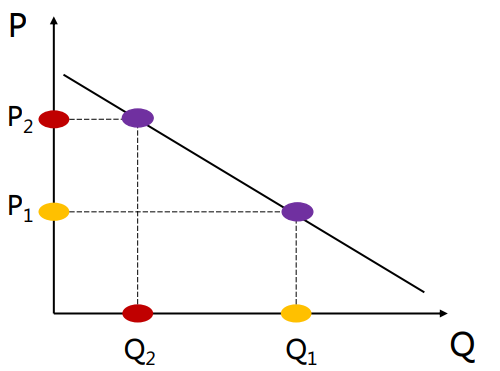
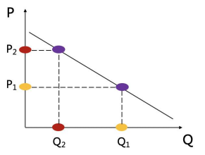
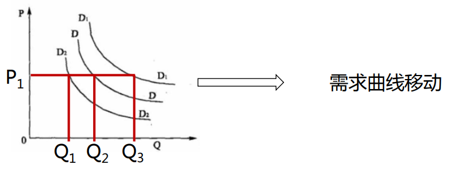
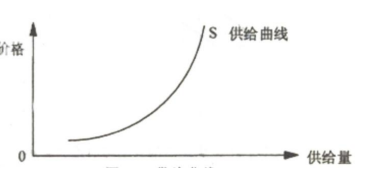
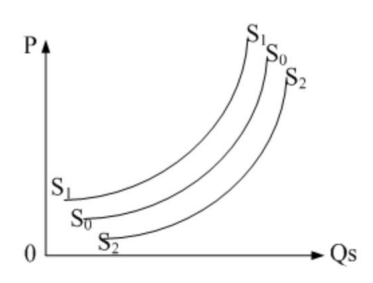

## 供求分析

### 需求函数
-   需求（demand）  
    >   消费者在<red>一定时间内</red>在各种可能的价格水平下<red>愿意且能够购买</red>的某种商品（或服务）的数量。  
    >   <red>需求规律（需求定理）：同一种商品的需求量与其价格呈反方向变动</red>。

-   四个要点：
    1.  一种商品（或服务）；
    2.  人们愿意且能购买；
    3.  在一定时间内；
    4.  除价格外，其他影响需求变动的因素都保持不变。
-   影响需求的因素  
    -   商品的价格。**需求向下倾斜**  
        

        价格越高，需求越少。  
        纵轴（纵坐标）：价格，用P表示  
        横轴（横坐标）：需求量，用Q表示  
    -   消费者收入水平。
    >   若收入水平提高，有支付能力的消费者就增加了，在相同价格水平下，需求量会增加。
    -   相关商品的价格。
    
    >   <red>替代品</red>一种物品价格上升引起另一种物品需求<red>增加</red>。  
    >   <red>互补品</red>一种物品价格上升引起另一种物品需求<red>减少</red>。

    -   消费者的偏好
-   需求函数
>   需求函数：需求量不影响需求量的各因素之间所建立的函数关系。  
    Qd = f(P,I,PR ,T……)  
    Qd：表示消费者对某种商品的需求量。  
    <red>P：表示该商品的价格。</red>  
    I：表示消费者的收入水平。  
    PR：表示不该商品有关的商品（替代品或互补品）的价格。  
    T：表示消费者偏好  
    
>   将其他因素视为不变，仅考虑<red>商品价格与需求量</red>之间的关系。  
    函数可以表示为： Qd = f(P)  
    价格和需求量之间的关系可以用<red>需求表和需求曲线</red>两种方式进行描述。
    
    
    -   需求表

        |价格（元）| 需求量（件）|
        | ------------- |-------------|
        | 200     | 1 |
        | 160     | 2 |
        | 120     | 3 |
        | 80     | 4 |
        | 40     | 5 |
    -   需求曲线    
        
>   纵轴（纵坐标）：价格，用P表示  
    横轴（横坐标）：需求量，用Q表示  
    D：表示需求曲线
    
-   个人需求与市场需求
    -   个人需求,
    >   在一定时期内，在其他因素不变的前提下，在该商品的任何一个可能的价格下，<red>消费者个人</red>愿意并且能够购买的某种商品的数量。
    -   市场需求
    >   在一定时期内，在其他因素不变的前提下，在该商品的任何一个可能的价格下， <red>市场上所有消费者</red>愿意并且能够购买的某种商品的数量。

### 需求量的变动和需求的变动
1.  需求量的变动
>   在某个时期内，当其他的条件不变的情况下，由于商品<red>价格的变动</red>所引起的消费者愿意且能够购买的商品数量发生变动。\

2.  需求的变动
>   在某商品价格不变的条件下，由于其他因素变动所引起的该商品的需求数量的变动。

3.  总结

|名称| 因素| 表现形式 |
| :------------- |:-------------|:-------------|
| <red>需求量变动</red> | <red>价格</red> | <red>沿需求曲线变动</red> |
| 需求变动 | 消费者收入水平 | 需求曲线移动 |
| 需求变动 | 相关商品的价格 | 需求曲线移动 |
| 需求变动 | 消费者偏好 | 需求曲线移动 |

### 需求估计与预测
**市场需求曲线的估计和预测的方法**
1.   市场调查的方法
>   访问调查法、市场实验法
2.   统计分析方法
>   <red>回归分析法</red>:  
    a、建立理论模型  
    b、收集数据  
    c、选择函数形式  
    d、对结果的估计和解释

## 供给分析
### 供给函数
1.  供给
    >   <red>生产者</red>在一定时间内在各种可能的价格水平下<red>愿意提供</red>而且<red>有能力提供</red>的某种商品（或服务）的数量。

    >   <red>供给定理（供给规律）</red>：商品的供给量与其价格是从呈同方向变动  

    -   影响供给的因素
        -   商品的价格：供给向上倾斜规律
        -   生产成本：成本越低，供给越多
        -   替代品的价格：替代品的价格越高，生产替代品的利润越大，企业越愿意生产。
        -   生产者对价格的期望
    -   供给函数
    >   供给量不影响供给量的各因素之间所建立的函数关系  
        QS = f(P,C,PR,E……)   
        QS：表示生产者对某种商品的供给量。  
        <red>P：表示该商品的价格。</red>  
        C：表示该商品的生产成本。  
        PR：表示该商品替代商品的价格。  
        E：表示生产者对商品价格的期望。
        
    >   将其他因素视为不变，仅考虑商品价格不供给量之间的关系  
        函数可以表示为： QS = f(P)  
        价格和供给量之间的关系可以用<red>供给表</red>和<red>供给曲线</red>两种方式进行描述。
    
    -   供给表
        |价格（元）| 需求量（件）|
        | ------------- |-------------|
        | 6     | 10 |
        | 8     | 20 |
        | 10     | 30 |
        | 12     | 40 |
        | 14     | 50 |
    -   供给曲线    
        

2.  供给量的变动和供给的变动
    -   供给量的变动
    >   是指在某个时期内，当其他的条件不变的情况下，由于商品价格的变动所引起的企业愿意和能够提供的商品数量发生变动。  

    
    -   供给的变动
    >   在某商品价格不变的条件下，由于其他因素变动所引起的该商品的供给数量的变动。  

    

3.  总结

|名称| 因素| 表现形式 |
| :------------- |:-------------|:-------------|
| <red>供给量变动</red> | <red>价格</red> | <red>沿供给曲线变动</red> |
| 供给变动 | 生产成本 | 供给曲线移动 |
| 供给变动 | 替代品的价格 | 供给曲线移动 |
| 供给变动 | 生产者对价格的期望 | 供给曲线移动 |

### 市场均衡分析
1.  市场均衡与供求法则
    -   市场均衡
    >   在影响需求和供给的其他因素都给定不变的条件下，市场上的商品价格达到这样一种水平，即消费者愿意购买的数量<red>等于</red>生产者愿意供给的数量。
    -   均衡价格：市场处于均衡状态时的价格。
    -   <red>均衡交易量（均衡产量、均衡销量、均衡数量）</red>：与均衡价格相对应的成交数量。    
    

2.  市场均衡的变动

    |   |供给未变| 供给增加 | 供给减少 |
    | ------------- |-------------|-------------|-------------|
    | 需求未变    | 价格相同 | 价格下降 | 价格上升 |
    | 需求未变    | 数量相同 | 数量增加 | 数量减少 |
    | 需求增加    | 价格上升 | 价格不确定 | 价格上升 |
    | 需求增加    | 数量增加 | 数量增加   | 数量不确定 |
    | 需求减少    | 价格下降 | 价格下降   | 价格不确定 |
    | 需求减少    | 数量减少 | 数量不确定  | 数量减少 |

    -   需求的变动与市场均衡量的变动
    >   前提条件：供给不变。  
    需求增加：均衡价格上升，均衡数量增加。  
    <red>需求减少</red>：均衡价格下降，均衡数量减少。
    
    -   供给的变动与市场均衡量的变动
    >   前提条件：需求不变。 
    供给增加：均衡价格下降，均衡数量增加。  
    <red>供给减少</red>：均衡价格上升，均衡数量减少。
    
    -   需求和供给同时变动与市场均衡量的变动
    >   1、供给和需求两条曲线都移动    
    2、两条曲线移动的<red>方向</red>  
    3、两曲线变动<red>幅度的大小</red>    

### 价格管制对市场均衡的影响
1.  政府规定最低价格
    >   **最低价格**：又称支持价格、价格下限。政府为了扶持某一行业的生产、保护生产的利益而规定的<red>高于</red>该行业产品均衡价格的一种<red>非市场价格</red> 。例如：最低工资规定、粮食最低收贩价，机票的最低折扣。

    >   后果：导致了<red>供给过剩</red>。

2.  政府规定最高价格
    >   **最高价格**：又称限制价格、价格上限。是指政府为了防止某些生活必需品的物价上涨而规定了<red>低于</red>这些物品的<red>均衡价格</red>的价格，即规定最高价格。 例如：经济适用房。  

    >   后果：导致了<red>稀缺物品</red>。