## 生产函数

### 生产函数的概念

#### 生产要素
>   指从事生产所必须投入的各种经济资源。包括：土地、劳动、资本、企业家才能。    

#### 生产函数
>   指在一定时期内，在技术水平不变的情况下，生产中所使用的各种<red>生产要素的数量</red>与所能<red>生产的最大产量</red>之间的关系。  

>   生产函数的一般形式为：  
>   Q=f（L，K，N，E）  
>  
>   注意点：  
>   1、<red>一定技术条件</red>为前提；  
>   2、生产函数表明的是一定数量的生产要素所能产出的<red>最大产量</red> 。

### 常见的生产函数

#### 柯布-道格拉斯生产函数
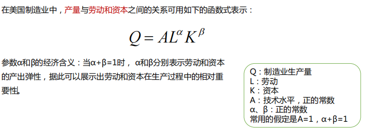

## 短期生产函数分析
>   在这个时期内，企业<red>不能</red>根据它所要达到的产量来<red>调整其全部生产要素</red>，只
能调整部分可变要素。

### 短期生产函数的概念
>   指企业在此期间内，只有<red>一种投入要素的数量是可变的</red>（如劳动力），<red>其他</red>投入要素的数量<red>不变</red>（如厂房、机器设备等）。  

>   短期生产函数主要研究<red>产出量</red>与<red>投入的变动要素</red>之间的关系，以确定单一可变要素的最佳投入量。

### 总产量、平均产量和边际产量

#### 概念

**总产量**

>   总产量（Total Product，TP）：一定量的某种生产要素所生产出来的全部产量。例如：TPL：指一定量的劳动投入所生产出来的全部产量，则： 

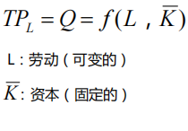

**平均产量**

>   平均产量（Average Product ，AP）：指平均每单位某种生产要素所生产出来的产量。例如：APL：指平均每单位劳动所生产出来的产量，则：  

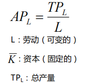

**边际产量**

>   边际产量（Marginal Product，MP）：指某种生产要素每增加一单位所增加的产量。例如：MPL：指每增加一单位劳动所增加的产量，则 ：  

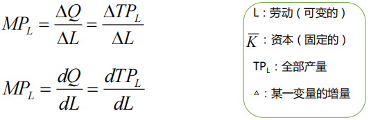

#### 总产量、平均产量和边际产量三者关系
>   1.随着劳动投入量增加：<red>最初</red>TPL 、APL 、MPL 都<red>增加</red>。但各自增加到一定程度后就分别开始递减。其中MPL最先开始递减。  
>   2.MPL与APL在APL曲线的<red>最高点</red>相交。  
>   3.当 <red>MPL =0时， TPL达到最大值</red>；

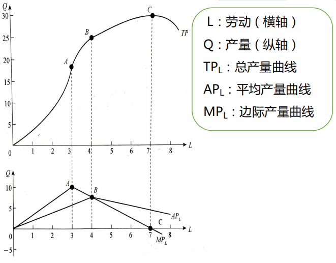

### 边际收益递减规律
在<red>技术水平不变</red>的条件下，当把一种可变的生产要素连续地投入到生产中时，<red>最初</red>这种生产要素的增加会使<red>边际产量增加</red>，但当该生产要素的增加<red>超过一定数量</red>之后，继续增加该要素的投入，<red>边际产量开始递减</red>，最终还会使<red>产量绝对减少</red>。

**理解边际收益递减规律应该注意的要点有：**  
1.  这一规律是以<red>生产技术状况既定不变</red>为前提。
2.  这一规律是以<red>一种要素可变</red>，而其他要素的投入量不变为前提。
3.  随着某种变动要素投入量的增加，边际收益一般要经历<red>递增、递减，最后成为负数</red>的过程。
4.  可变生产要素的各个单位是<red>同质</red>的。
5.  如果各生产要素只能按固定比例组合，这个规律就不适用了。

### 生产三阶段
**<red>第Ⅰ、 第Ⅱ</red>为变动要素合理投入区间**
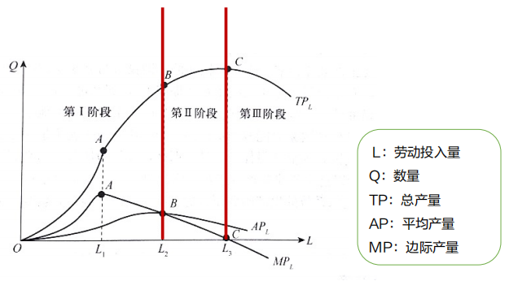

#### 第Ⅰ阶段
>   1、可变要素投入量：0-L2 <red>（平均产量最大）</red>  
>   2、特点：平均产量一直在递增，直至最大值。

#### 第Ⅱ阶段
>   1、可变要素投入量：L2-L3<red>（边际产量为0）</red>  
>   2、特点：<red>平均产量和边际产量都开始递减</red>。

#### 第Ⅲ阶段
>   1、可变要素投入量：L3以后的阶段。  
>   2、特点：边际产量变为<red>负值，总产量开始递减</red>

### 一种生产要素变动时要素最佳投入量的确定

#### 边际产品价值
>   边际产品价值（value of marginal product，VMP）：每增加一个单位某种可变生产要素所增加
的收入。

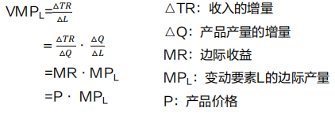

#### 生产要素的边际成本
>   生产要素的边际成本（marginal factor cost, MFC）：每增加使用一单位的某种可变生产要素所增
加的成本。

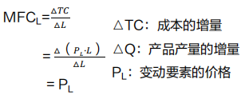

#### 生产要素最佳投入量的确定
>   **边际产品价值（VMP）**：每增加一个单位某种可变生产要素所增加的收入。  
>   **生产要素的边际成本（MFC）**：每增加使用一单位的某种可变生产要素所增加的成本。
```
    边际产品价值(VMP) = 生产要素的边际成本（MFC）
    P· MPL = PL
```


## 长期生产函数分析

### 等产量曲线

#### 概念
>   在<red>技术水平不变</red>的条件下，生产<red>同一产量</red>的两种生产要素投入量的各种不同组合的轨迹。

#### 等产量曲线的特点
>   1、向右下方倾斜的曲线。  
>   2、在同一平面上可以有无数条等产量曲线，原点越远的等产量曲线所代表的产量水平越高。  
>   3、在同一平面图上，任意两条等产量曲线不能相交。  
>   4、等产量曲线的形状反映出两种投入要素的<red>替代性</red>。  

#### 边际技术替代率
>   边际技术替代率(marginal rate of technical substitution，MRTS)，为了<red>维持</red>相同产量水平
，<red>增加</red>一种生产要素的数量与可以<red>减少</red>的另一种生产要素的数量<red>之比</red>。

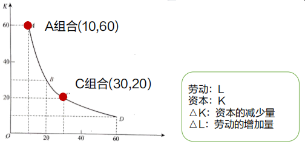

设两种可替代的投入要素分别为L与K，则边际技术替代率可表示为：
```
MRTS = − △ K / △ L
```

>   边际技术替代率递减的原因：边际收益递减规律作用的结果。

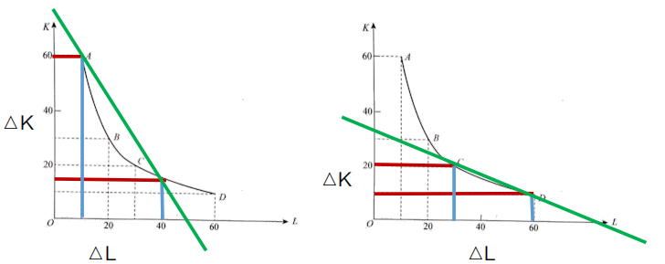

>   等产量曲线上某一点的<red>边际技术替代率</red>=等产量曲线在该点的<red>切线的斜率</red>。  
>   边际技术替代率递减  
>   等产量曲线为凸向原点的曲线

### 等成本线

#### 概念
>   表明成本与生产要素价格既定的条件下，可以购买到的两种生产要素数量的最大组合的线。

#### 等成本线的方程、斜率
成本固定为C，L要素价格PL，K要素的价格PK  
等成本线的方程为：

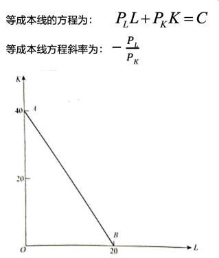

#### 等成本线的特征
>   1、要素价格不变，等成本线是一条<red>直线</red>。  
>   2、投入成本<red>增加</red>，等成本线平行<red>右移</red>。  
>   3、距离原点越远的等成本线表明支出的成本<red>越高。</red>  

### 生产要素最佳组合的确定

#### 生产要素最佳投入量的确定
>   情况一：选择一种要素投入的组合，使得企业能够在<red>既定的产量</red>下，所费成本最少；  
>   情况二：选择一种要素投入的组合，使得在<red>既定成本</red>下，所生产的产量最大。

#### 产量既定成本最小的要素组合

#### 成本既定产量最大的要素组合

#### 生产要素最佳组合原则

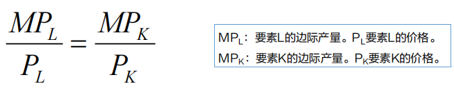  

在L要素上多投入1单位货币所得到产量=在K要素上少投入1单位货币所损失的产量。

## 规模报酬

## 生产函数与技术进步