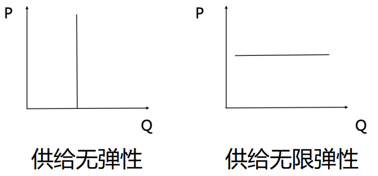

## 需求弹性
>   指一种商品的<red>需求量对其影响因素变动的反应敏感程度</red>。

影响需求的因素：
商品的价格：需求价格弹性  
消费者收入水平：需求收入弹性  
相关商品的价格：需求交叉弹性  
消费者偏好

### 需求价格弹性
>   一种商品需求量变动对其价格变动的反应程度。一般用需求价格弹性<red>系数</red>来表示需求价格弹性的<red>大小</red>。

#### 计算公式

**一般公式**
>   给出价格和需求量变化的百分比


**弧弹性公式**
>   给出变化前后的价格和需求量。


**点弹性公式**
>   给出需求函数。


#### 需求价格弹性的种类
>   根据需求价格弹性系数**绝对值**的大小，可以把商品的需求价格弹性分为五种类型。

|需求价格弹性系数（绝对值）|需求价格弹性类型|例子| 
|:---:|---|:---:|
|Ed=0|需求完全无弹性|食盐|
|Ed<1|需求缺乏弹性|食品、药品|
|Ed=1|需求单位弹性| |
|Ed>1|需求富有弹性|奢侈品|
|Ed=∞|需求完全弹性| |


#### 影响需求价格弹性的主要因素
>   口诀：中臂剃光的时间
1.  商品的**替**代性。  
2.  商品用途的**广**泛性。  
3.  商品对消费者生活的**重**要程度。  
4.  商品的消费支出在消费者预算总支出中所占的**比**重。  
5.  所考察的消费者调节需求量的**时间**。

#### 需求价格弹性的应用
<red>需求价格弹性是企业制定价格政策的基础</red>

-   需求完全无弹性(Ed＝0) 
降价：销售收入<red>减少</red>；  
涨价：销售收入<red>增加</red>；
>   无论降价还是涨价，需求量不变。  

| |原价|降价后|涨价后|变动百分比|
|:---:|:---:|:---:|:---:|:---:|
| 价格 | 100|9 |11 |10% |
| 需求量 | 100 | 100 | 100 | 0%|
|销售收入 | 1000|900 |1100 | |
---
-   需求缺乏弹性(Ed<1)   
降价：销售收入<red>减少</red>；  
涨价：销售收入<red>增加</red>；
>   需求量的相对变化小于价格的相对变化。

| |原价|降价后|涨价后|变动百分比|
|:---:|:---:|:---:|:---:|:---:|
| 价格 | 10|9 |11 |10% |
| 需求量 | 100 | 108 | 92 | 8%|
|销售收入 | 1000|972 |1012 | |
---
-   需求单位弹性(Ed=1)   
降价和涨价的销售收入<red>一样</red>；
>   需求量的相对变化等于价格的相对变化。

| |原价|降价后|涨价后|变动百分比|
|:---:|:---:|:---:|:---:|:---:|
| 价格 | 10|9 |11 |10% |
| 需求量 | 100 | 110 | 90 | 10%|
|销售收入 | 1000|990 |990 | |
---
-   需求富有弹性(Ed>1)   
降价：销售收入<red>增加</red>；  
涨价：销售收入<red>减少</red>；
>   需求量的相对变化大于价格的相对变化。

| |原价|降价后|涨价后|变动百分比|
|:---:|:---:|:---:|:---:|:---:|
| 价格 | 10|9 |11 |10% |
| 需求量 | 100 | 120 | 80 | 20%|
|销售收入 | 1000|1080 |880 | |
---
-   需求完全弹性(Ed＝∞)   
>   在既定价格上，消费者对这一商品的需求量是无穷大的，收入可以
无限增加，因此，<red>企业不会降价销售。但如果企业提高该商品的价格，该商品便无人问津，企业销售收入减少为零</red>。


### 需求的收入弹性
>   指一种商品需求量的变动对**收入变动**的反应程度。

|需求收入弹性系数| 类型 |例子||
|:---:|:---:|:---:|:---:|
|EM＜0 |需求收入负弹性 |公共交通| 特殊商品（低档商品）|
|EM=0 |需求收入无弹性 |食盐 |特殊商品（低档商品）|
|EM＜1 |需求收入缺乏弹性 |生活必需品|正常商品|
|EM=1 |需求收入单位弹性 |衣服 |正常商品|
|EM＞1 |需求收入富有弹性 |高档消费品、奢侈品|正常商品|

>   恩格尔系数：表示一个国家生活水平高低或富裕程度的一个指标
```
恩格尔系数= 食物支出金额 / 总支出（或总收入）金额
```

### 需求交叉弹性
>   <red>一种商品的需求量的变动</red>对于它的<red>相关商品的价格变动</red>的反应程度。  
相关商品：  
1、替代品：一种物品价格上升引起另一种物品需求增加。  
2、互补品：一种物品价格上升引起另一种物品需求减少。

|需求交叉弹性系数 |产品关系|
|:---:|:---:|
|EC＜0 |互补|
|EC＝0 |无关系|
|EC＞0 |替代|

## 供给弹性

### 供给价格弹性的概念
>   一种商品<red>供给量的相对变动</red>相对于其<red>价格的相对变动</red>的反应程度。
```
供给价格弹性系数(Es)
    = 供给量变动的百分比 ÷ 价格变动的百分比 
    = (△Q ÷ Q) ÷  (△P ÷ P)
    = (△Q ÷ △P) x  (P ÷ Q)
```

### 供给价格弹性的分类

|供给价格弹性系数| 类型 |例子|
|:---:|:---:|:---:|
|Es=0 |供给无弹性 |珍贵艺术品、古董|
|0＜Es＜1 |供给缺乏弹性| 农产品|
|Es=1 |供给单位弹性| 无|
|1＜Es＜∞ |供给富有弹性| 工业品|
|Es=∞ |供给无限弹性|无|



### 影响供给价格弹性的主要因素
1.  商品生产时间的长短
2.  商品生产的周期
3.  生产规模和规模变化的难易程度
4.  生产成本的变化