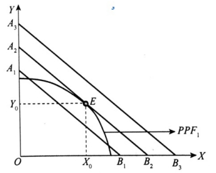

##  边际分析

### 收益

#### 总收益(TR)
>   **总收益（ total revenue，TR）**：指企业销售一定量的产品所得到的全部收入。   
>   总收益=商品单价×销量  
>   TR=P·Q

#### 平均收益(AR)
>   **平均收益（ average revenue，AR）**：指企业每销售一单位产品平均得到的收入。  
>   **平均收益** = 总收益 / 销量  = 价格×销量 / 销量  **= 价格**  
>   AR = TR / Q = P * Q / Q = P

#### 边际收益(MR)
>   **边际收益（ marginal revenue，MR）**：指企业每增加销售一单位产品总收入的增量。  
>   **边际收益 = 总收益增量 / 销量增量**  
>   MR = △TR / △Q  
>   MR = dTR / dTQ


### 利润最大化
>   **总利润最大化条件： 边际利润 = 0**  
>   也就是：**边际收益（MR）= 边际成本（MC）**

##  盈亏平衡分析

### 盈亏平衡分析的基本原理

#### 保本分析法
>   总收益 = 总成本  
>   销量 × 单价 = 总固定成本 + 总变动成本  
>   **销量** × 单价 = 总固定成本 + **销量** × 单位变动成本  

-   给出总固定成本，单位变动成本，单价，确定销量  
>   **销量 = 总固定成本 / (单价 - 单位变动成本)**

-   给定企业的目标利润π，总固定成本，单位变动成本，单价。求目标利润下的目标销售量Q  
>   **销量 = (总固定成本 + 总利润) / (单价  -单位变动成本)**

### 经营杠杆率

企业**固定成本总额**与**变动成本总额**的比率

##  生产可能性曲线及产品产量最佳组合的确定

### 生产可能性曲线

#### 生产可能性曲线的概念
>   在**既定资源和技术条件下**，能够生产的各种产品产量的最大组合的轨迹。

#### 生产可能性曲线的特征


>   1.  生产可能性曲线是**向右下方倾斜**的。
>   2.  在一般情况下，生产可能性曲线是**向右上方凸出**的。
>   3.  通过生产可能性曲线，可以划分：
>       -   生产可能性区域：生产可能性曲线上。
>       -   生产无效率区域：G点所在区域。
>       -   生产不可能区域：F点所在区域。

#### 边际转换率

>   边际转换率（ marginal rate of transformation ，MRT） :  
>   指在**资源一定**的条件下，**增加**单位某种产品的生产所必须**放弃**的另一种产品的数量  
>   MRT = -△Y / △X

边际转换率递增：生产可能性曲线向右上方凸出表示

### 等收益线

#### 等收益线的概念
>   在**既定收入条件**下，所必须生产的两种产品的产量的最大数量组合的轨迹

#### 等收益线方程、斜率

-   方程
**TR = Px * X + Py * Y**


-   斜率
**-Px / Py**


```
设某企业生产电视机和电冰箱的收益目标是100万元，电视机的价格为1000元，
生产了x台。电冰箱的价格为800元，生产了y台。请列出方程。
1000x+800y=1000000 (等收益线)
```

### 产品产量的最佳组合确定

#### 资源既定收益最大的产品产量组合



>   资源既定，收益最大。  
>   生产可能性曲线：1条  
>   等收益线：无数条。

#### 收益既定资源耗费最小的产品产量组合


>   收益既定，资源耗费最小。  
>   生产可能性曲线：无数条  
>   等收益线：1条。

#### 产品产量最佳组合原则

>   **MCX / PX = MCY / PY**  
>   MCX X商品的边际成本  
>   PX：X商品的价格  
>   MCY：Y商品的边际成本  
>   PY：Y品的价格  
>   含义：X产品的单位收益所消耗的成本= Y产品的单位收益所消耗的成本

```
MCX / PX > MCY / PY
策略：多生产Y产品，减少X产品的生产。

MCX / PX < MCY / PY
策略：多生产X产品，减少Y产品的生产。


```