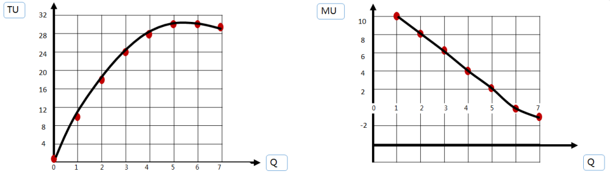
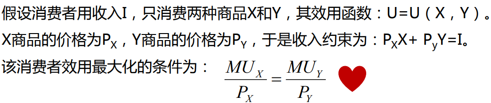

## 消费者效用分析

## 效用理论概述

###  效用的概念
>   **效用（utility）**：**消费者**在消费商品戒服务时所感受到的满足

1.  三个特点：
    -   效用是消费者对商品和服务的**主观评价**。
    -   效用因人、因时、因地而不同。
    -   效用本身**不包括**有关是非的价值判断。
2.  效用理论的基本假设
    -   完全信息
    -   偏好次序
3.  基数效用与序数效用
    -   基数效用论
    >   形成于19世纪。效用是一个数量概念。认为，一种商品或劳务效用的大小，可以用**基数**（1，2，3· · ·）测量。衡量单位是效用单位（Util，尤特尔）。
    -   序数效用论
    >   产生于20世纪30年代。效用是一个次序概念。认为，效用的绝对量大小根本无法测定，无法用某种统一的单位表示出来，它们只能根据消费者的个人偏好程度排列出效用大小先后的顺序。

## 基数效用论与边际效用分析

### 总效用与边际效用
>   总效用(TU)：指消费者在**一定时期内**从**一定数量的商品**消费中获得的效用量的**总和**  
>   边际效用(MU) ：指消费者在**一定时间**内**增加一单位商品**的消费时，所获得的总效用量的**增量**。



>   当MU>0时，总效用曲线呈**上升**趋势。表明总效用会随着消费量的增加而增加，但增加的幅度是递减的。  
>   当MU=0时，总效用曲线达到**最高点**，表明总效用取得**最大值**。  
>   当MU<0时，总效用曲线呈**下降**趋势，表明总效用随着消费量的增加而减少。  

### 边际效用递减规律
>   边际效用递减规律：随着 **消费数量**增加，边际效用呈**下降趋势**的现象。 某一种商品的边际效用大小，主要取决于**商品消费量**的大小。

### 消费者均衡
>   单个消费者把**有限的货币收入**分配在对各种商品的贩买中获得**效用的最大化**。



**普通求导：**
-   例如：f(x)=x²
```
 求导后的叫做导函数，写作：
𝑑𝑓(𝑥) / 𝑑𝑥 = 2x
```

-   例如：f(x)=x²+3x
```
求导后的叫做导函数，写作：
𝑑𝑓(𝑥) / 𝑑𝑥 = 2x+3
```

-   例如：f(x)=x²+3x+10
```
求导后的叫做导函数，写作：
𝑑𝑓(𝑥) / 𝑑𝑥 = 2x+3
```

-   总结：
>   求导，每一项都不改变符号。  
>   常数项在导数中为0。  
>   一次方项，直接变为常数。  
>   二次方项：系数：次方和系数相乘，次方：次方减1做。  


**偏分求导**  
一个函数中有两个变量的时候会用到。
-   例如： U=XY。对X求导。
```
求到后叫做偏导数，写作
∂𝑈 / ∂𝑋 = Y
```
-   例如： U=XY。对Y求导
```
求到后叫做偏导数，写作
∂𝑈 / ∂𝑌 = X
```

-   总结：
>   偏分求导，对谁求导就把另外一个变量看做是常数，在利用普通求导的方法求导就可以了。

### 个人需求曲线的推导
由于随着**消费商品数量的增加**，给消费者带来的边际效用是递减的，因此，消费者愿 意支出的货币（支付的价格）也是**递减**的

###  消费者剩余
>   消费者愿意为某一商品支付的价格不他在贩买该商品时实际支付的价格之间的**差额**。

## 序数效用论与无差异曲线分析

### 无差异曲线的性质
1.  无差异曲线的性质
>   表示消费者偏好相同的**两种商品的不同数量**的各种组合。  

>   无差异曲线是向右下方倾斜的，其形状凸向原点的。  
>   任意两条无差异曲线之间**不能相交**。  
>   离原点越远的无差异曲线所代表的效用水平越高

2.  边际替代率
>   **边际替代率：无差异曲线上某点切线的斜率。 即：斜率=边际替代率**

>   消费者在保持自己**效用水平不变**的情况下，为了增加一种商品（X）的消费量所愿意放弃的另一种商品（Y）的消费量

### 消费者的预算线
给定的价格和收入下，消费者把所有收入用于消费所能获得的商品组合点的轨迹。

### 消费者均衡
>   在预算**给定**的情况下，消费者通过决定两种商品的消费量使得自己的**效用**最大化的状态