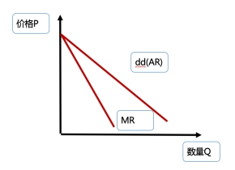
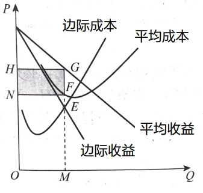
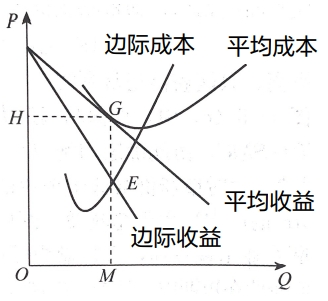
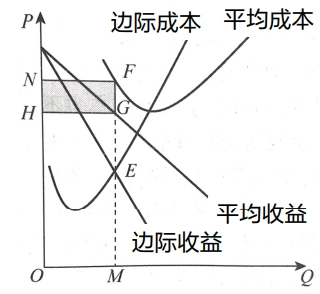

## 垄断市场的条件及企业收益规律

### 垄断市场的条件及形成原因

#### 垄断市场的定义
>   **一家**企业完全控制整个行业的市场结构，即一家企业控制了某种产品或服务的市场。

#### 垄断市场的条件
1.  在一个行业或在某一特定市场中，只有一家企业提供全部产品，没有竞争对手存在。
2.  企业所生产和出售的商品没有相近的代用品。
3.  其他任何企业进入该行业或市场都极为困难或不可能。

#### 垄断市场产生的原因
>   垄断市场形成的根本原因：进入障碍  
>   进入障碍的来源：
>   -   独家企业控制关键资源
>   -   规模经济的存在：以低的成本进行生产
>   -   政府特许

### 垄断市场中的企业收益规律


>   1.  平均收益曲线(AR曲线)和需求曲线(dd曲线)合二为一。
>   2.  边际收益曲线(MR曲线)小于平均收益曲线和需求曲线。

## 垄断市场中的企业决策

### 企业短期决策

>   **企业短期决策原则: 边际收益MR=短期边际成本SMC**

#### 企业短期决策-盈利


```
利润最大化原则：边际收益MR=边际成本MC，E点
确定产量：OM
价格：OH
平均成本：MF
总收益：OMGH
总成本：OMFN
利润：NFGH
```

#### 企业短期决策-盈亏平衡


```
利润最大化原则：边际收益MR=边际成本MC，E点
确定产量：OM
确定价格：OH
平均成本：OH(或MG)
总收益：OMGH
总成本：OMGH
利润：盈亏平衡
```

#### 企业短期决策-亏损


```
利润最大化原则：边际收益MR=边际成本MC，E点
产量：OM
价格：OH
平均成本：ON
总利益：OMGH
总成本：OMFN
亏损：NHGF
```

>   停产还是继续生产？  
>   在边际收益MR=边际成本MC的产出水平下：  
>   若**价格P＞平均变动成本AVC，继续**生产；  
>   若**价格P＝平均变动成本AVC，继续**生产或停止生产均可；  
>   若**价格P＜平均变动成本AVC，停止**生产

### 企业的长期决策

#### 企业的长期决策的定义
>   在垄断市场中，短期获得超额利润，这是如果别的企业想进入市场，会有进入壁垒，所以**垄断企业在长期依然存在超额利润**。而且垄断企业会通过调整生产规模进一步降低长期平均成本，从而获得**比短期更多的超额利润**

#### 企业长期均衡的条件
>   **边际收益MR=长期边际成本LMC**

### 垄断企业的供给曲线
>   **垄断企业没有供给曲线**  
>   凡是带有垄断因素的不完全竞争市场，不存在企业或行业的供给曲线

### 垄断企业的竞争战略
1.  **细分市场**
2.  **进入障碍**

## 垄断管制

### 垄断与低效率
1.  垄断与消费者剩余
2.  垄断与寻租  
    **寻租**：指个人和团体为了把别人的收入重新分配（或转移）到自己手中，而花费资源来影响政府的公共政策的行为。
3.  垄断的净损失  
    **净损失**：部分消费者剩余的减少并没有转移给生产者或其他方。

### 政府对垄断的管制
1.  价格管制
    -   按**边际成本定价**：**提高效率**，使得社会资源得到最优配置。
    -   按**平均成本定价**：**更低的公平价格**
2.  反垄断法

