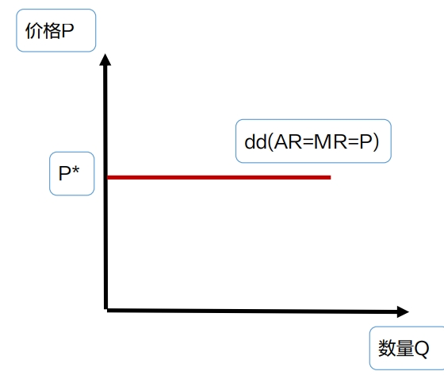
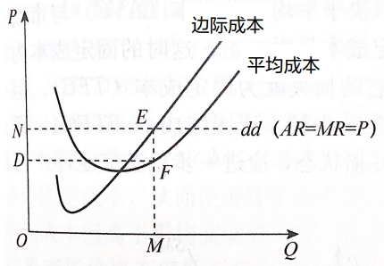
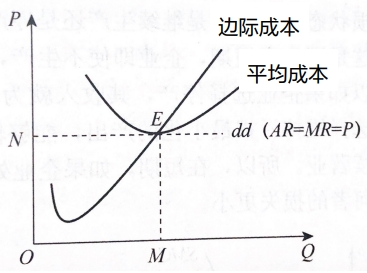
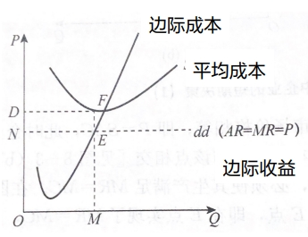
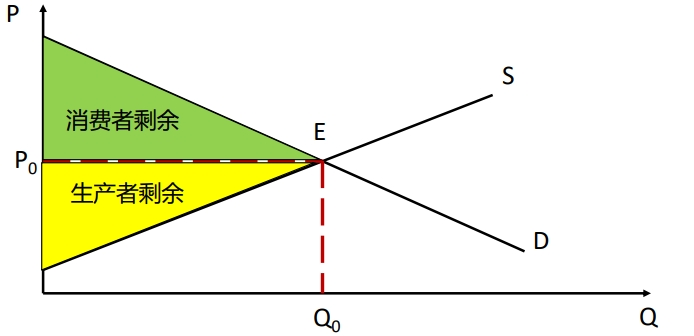

## 完全竞争市场的条件及企业收益规律

### 完全竞争市场的条件
>   完全竞争市场（纯粹竞争市场）：竞争不受任何阻碍和干扰的市场结构。
1.  市场上有**大量**的卖者和买者：市场均衡价格由供求关系决定，不由买者或卖者决定
2.  市场上所出售的商品和劳务是**同质**的，即不存在产品差别
3.  市场上的各种生产资源可以充分自由地流动，**不受任何因素的阻碍**
4.  市场信息是**畅通**的

### 完全竞争市场中的企业收益规律

#### 企业需求曲线(dd曲线)
>   完全竞争市场的企业需求曲线是**水平**的。

#### 平均收益曲线(AR曲线)
>   完全竞争市场的平均收益曲线是**水平**的。

```
平均收益 = 总收益 / 销量
        = 价格 × 销量 / 销量
        = 价格
        = P*
```

#### 边际收益曲线(MR曲线)
>   完全竞争市场的平均收益曲线是**水平**的。

>   完全竞争市场中：**三线重合为一条曲线**




## 完全竞争市场中的企业决策

### 企业短期决策

#### **盈利**均衡图（总收益＞总成本）



>   企业成本水平低：平均成本SAC＜价格P  
>   利润最大化原则：边际收益MR=边际成本MC（E点）  
>   总收益：长方形OMEN  
>   总成本：长方形OMFD  
>   利润：长方形DFEN

#### **盈亏平衡均衡图（总收益＝总成本）**



>   平均成本等于市场价格：平均成本SAC＝价格P  
>   利润最大化原则：边际收益MR=边际成本MC（E点）  
>   总收益：长方形OMEN  
>   总成本：长方形OMEN

#### **亏损**均衡图（总收益＜总成本）



>   企业成本水平高：平均成本SAC＞价格P  
>   利润最大化原则：边际收益MR=边际成本MC（E点）  
>   总收益：长方形NOME  
>   总成本：长方形DOMF  
>   亏损：长方形NDFE

#### 停止营业点原则
>   在短期生产状态下，企业处于**亏损**状态，这时在决策中将**固定成本**看成**沉没成本**，不考虑其大小和回收问题。根据**价格P**和**平均变动成本AVC**的关系，来决定企业是否继续维持生产。  
>   三种情况  
>   平均变动成本AVC＜价格P  
>   平均变动成本AVC=价格P  
>   平均变动成本AVC＞价格P

-   情况一：**平均变动成本＜价格＜平均成本 继续生产**

-   情况二：**价格＜平均变动成本＜平均成本 停止生产**

-   情况三：**价格＝平均变动成本＜平均成本 停止生产或者继续生产都可以**

#### 企业短期决策总结
企业实现利润最大化（或亏损最小化）的条件为：边际收益（MR）=边际成本（MC）  

当亏损时是否停止生产（停止营业点）：价格（P）=平均变动成本（AVC）=边际成本（MC）

## 完全竞争市场经济绩效的评价

### 生产者剩余



卖者得到的货币额减去可变生产成本后的差额。生产者剩余实际上是衡量卖者参与市场所得到的收益。

消费者剩余：用来衡量消费者福利

生产者剩余：用来衡量生产者福利

社会总福利：消费者剩余+生产者剩余

>   **完全竞争市场使社会福利实现最大化**

### 资源配置

>   完全竞争市场，企业在其利润最大化的均衡点呈现：**价格P=边际成本MC**

1.  资源配置  
    资源配置的有效性：在完全竞争市场中，企业在利润最大化的均衡点上出现**价格=边际成本**，说明了资源在各种产品的生产之间的配置处于最优状态。

2.  生产效率  
    生产的有效性：在完全竞争的条件下，企业可以实现成本最小化，在最佳规模上生产，从而实现最高的生产效率。

