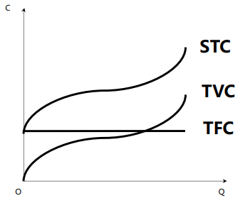
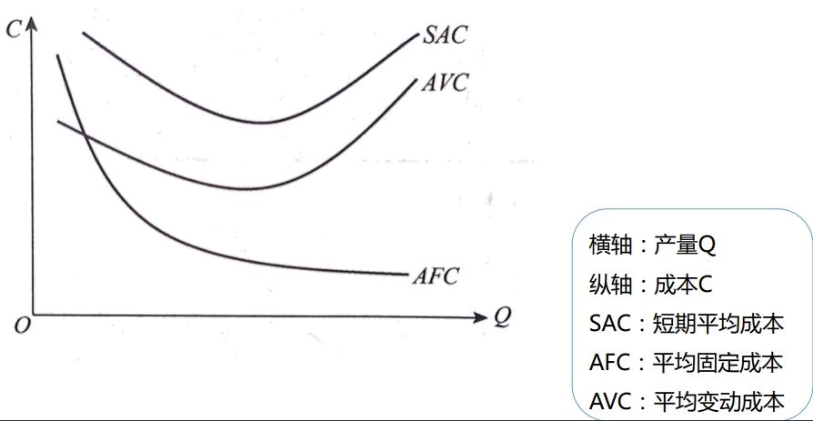
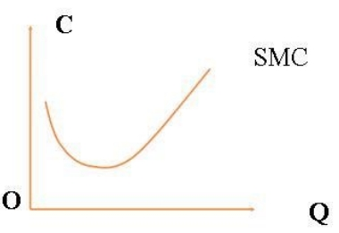
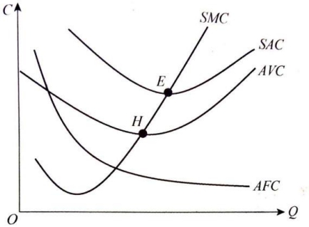
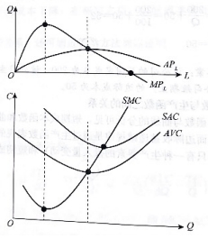
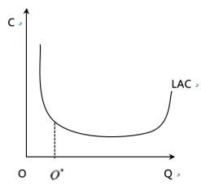

## 成本与利润概述

### 成本的含义
**企业进行生产经营活动所使用的**生产要素的价格，或生产要素的所有者必须得到的**报酬或补偿**。

### 成本的分类

#### 固定成本和变动成本
分类标准：**成本总额与产量**的关系。
>   **固定成本**：在一定限度内成本的总额**不随**产量变动而变动的成本。  
>   **变动成本**：在一定限度内成本的总额**随**产量变动而变动的成本。

#### 增量成本和沉没成本
分类标准：与**决策**有无关系。
>   **增量成本(相关成本)**：**由于某项生产决策**而产生的相关成本，即总成本的增量。  
>   **沉没成本(非相关成本)**：企业已经发生而无法收回，或**不因生产决策**改变的成本。

#### 显性成本和隐性成本
>   **显性成本**：企业购买或租用所需要的生产要素的**实际支出**。  
>   **隐性成本**：在形式上**没有支付义务**的，企业为使用自己提供的那一部分生产要素而支付的作为报酬的费用。

#### 会计成本和机会成本
>   **会计成本**：在财务分析中使用的一种成本概念。它是指企业在生产活动中按市场价格支付的一切生产要素的费用。**（会计成本=显性成本）**  
>   **机会成本**：生产者所放弃的使用相同生产要素在其他生产用途中所能得到的**最高收入**。

### 利润

#### 正常利润
企业家才能的报酬，承担风险的报酬，企业家人才的价格，企业家人才的机会成本。

#### 经济利润
又称**超额利润**，指企业的**总收益和总成本**之间的差额。即：
>   **经济利润 = 总收益 － 总成本**  
>   **= 总收益－（显性成本+隐性成本）**


#### 会计利润
企业销售产品的**总收益**减去 **会计成本（显性成本）** 后的余额。即：
>   **会计利润=总收益－显性成本**  

#### 利润贡献
又称**毛利**，**总收益**减去**变动成本**后的余额。即：
>   **利润贡献=总收益-变动成本**

## 短期成本与长期成本分析

成本函数：反映了企业产品**成本与产量**之间的变动关系

>   **短期成本函数**：生产经营过程中至少有一种或若干种投入要素的数量固定不变， 形成的**产量和成本**之间的关系。  
>   **长期成本函数**：生产经营过程中所有的投入要素都是可以改变的，形成的**产量和成本**之间的关系。

### 短期成本分析

#### 短期总成本



短期总成本（ short-run total cost ，STC）：指在短期内生产一定量产品所消耗的全部成本。  
总固定成本：total fixed cost, TFC  
总变动成本： total variable cost，TVC  
```
短期总成本 = 总固定成本 + 总变动成本
STC = TFC + TVC
```

#### 短期平均成本



```
平均成本 = 平均固定成本 + 平均变动成本
SAC = AFC + AVC

短期平均成本 = 短期总成本 / 产量
            = (总固定成本 + 总变动成本) / 产量
            = (总固定成本 / 产量) + (总变动成本 / 产量)
            = 平均固定成本 + 平均变动成本
```

#### 短期边际成本



```
SMC = △STC / △Q 
    = (△TFC + △TVC) / △Q
    = △TVC / △Q

    为什么△TFC不见了？
    总固定成本不变，△TFC = 0
```

#### SAC曲线与SMC曲线之间的关系



SAC：短期平均成本  
AFC：平均固定成本  
AVC：平均变动成本  
SMC：短期边际成本

1.  AFC—直向右下方倾斜，表明随着产量的增加，分摊到每件产品中的固定费用减少。
2.  AVC、SAC、SMC曲线都呈“U”形，表明这三种成本最初都随着产量的增加而下降，当下降到一定程度后，又随着产量的增加而上升。
3.  SMC与SAC一定相交于SAC的最低点（E点）。
4.  SMC与AVC相交于AVC的最低点（H点）。

#### 边际产量和边际成本的关系



1.  当MPL达到最高时，对应的MC到达最低
2.  当APL到达最高时AVC处于最低点
3.  MC与AVC和MPL与APL的交点对应


### 长期成本分析

#### 长期总成本
长期总成本(long-run total cost , LTC)：企业在长期中调整生产规模，生产各种产量所需的最低成本点的轨迹。

#### 长期平均成本
长期平均成本(long-run average cost , LAC)：单位产量所分摊的长期总成本。



>   Q*最小最优生产规模
>   长期平均成本曲线呈现“U”形：
>   1、长期平均成本曲线呈现先降后升的U形特征是由于**规模经济规律作用**的结果。
>   2、长期平均成本曲线的位置由外在经济和外在不经济所决定

#### 长期边际成本
长期边际成本(long-run marginal cost , LMC)：当企业有足够的时间根据生产产量调整其固定要素时，每增加一个单位的产量所增加的总成本。
