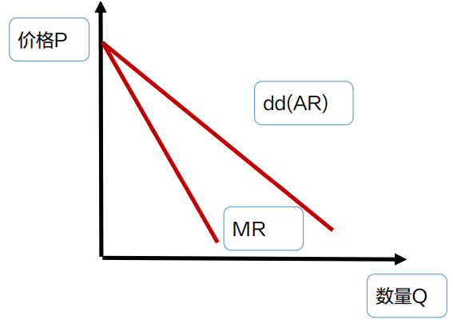
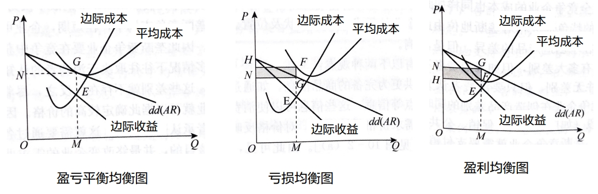

## 垄断竞争市场的条件和企业收益规律

### 垄断竞争与垄断企业的区别
1.  垄断企业成本：主要是生产成本。
2.  垄断竞争企业：除了生产成本外，还有销售成本（广告费、新品展销费、推销人员工资等）

### 垄断竞争市场的定义
>   在一个市场中，有**许多**企业生产和销售**有差别的同种产品**的市场结构。

### 垄断竞争市场具备的条件
>   1.  市场上有较多企业，彼此之间存在激烈的竞争。
>   2.  产品之间既存在一定的差别，又有一定的替代性。
>   3.  企业进出行业比较自由。

### 垄断竞争市场的企业收益规律(与垄断市场一致)

边际收益(MR)＜平均收益(AR)=价格(P)

## 垄断竞争市场中的企业决策

### 垄断竞争企业的短期决策

#### 垄断竞争企业的短期决策原则
>   垄断竞争企业的短期决策原则：**边际收益MR=短期边际成本SMC**

#### 垄断竞争市场均衡图

### 企业的长期决策

#### 垄断竞争企业长期均衡的形成条件
>   边际收益MR=长期边际成本LMC  
>   价格P=平均收益AR=平均成本LAC

#### 垄断竞争企业长期均衡的形成
-   企业短期超额利润
    1.  长期内吸引新企业或扩大自己的生产规模
    2.  整个行业生产和供给增加
    3.  市场均衡价格下降
    4.  需求曲线左下方移动，且生产成本和销售成本提高
    5.  超额利润消失，企业只获得正常利润
-   企业短期亏损
    1.  长期内企业会考虑退出或缩小生产规模
    2.  整个行业生产和供给减少
    3.  市场均衡价格上升
    4.  需求曲线右上方移动
    5.  亏损消失，企业获得正常利润    

### 垄断竞争企业的竞争战略
1.  品质竞争
2.  各种促销活动

## 对垄断竞争市场的评价